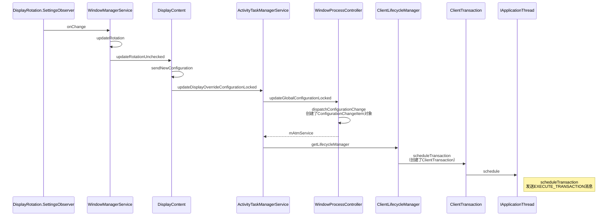
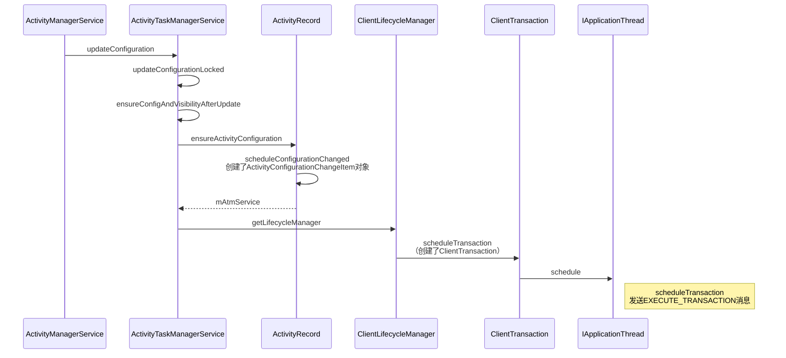
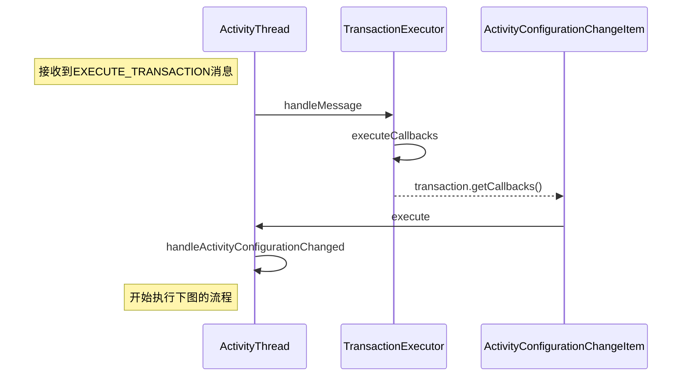

# 屏幕旋转执行流程


### 配置改变











### 重启Activity


```
config change -> ActivityThread.handleRelaunchActivity()	— 	r.activity.mChangingConfigurations = true;  
    -> handleRelaunchActivityInner()
    	-> handleDestroyActivity() 
				-> performDestroyActivity() 	— 	r.lastNonConfigurationInstances = r.activity.retainNonConfigurationInstances();
		-> handleLaunchActivity()
				-> performLaunchActivity()	—	activity.attach(…, r.lastNonConfigurationInstances, config,…);
```


 如果Configuration发送改变，ActivityThread会收到`EXECUTE_TRANSACTION`消息，然后调用`TransactionExecutor`执行`ConfigurationChangeItem`的

继承ClientTransactionItem的类；

|类|描述|
|:-:|:--|
|ActivityLifecycleItem|	Lifecycle的抽象类；这个后面再细看；|
|ActivityConfigurationChangeItem|	Activity Configuration Changed消息；|
|ActivityResultItem|	Activity Result消息；  |
|ConfigurationChangeItem|	App configuration change消息；  |
|MoveToDisplayItem|	Activity move to a different display消息；  |
|MultiWindowModeChangeItem|	Multi-window mode change消息；  |
|PipModeChangeItem|	Picture in picture mode change消息；  |
|WindowVisibilityItem|	Window visibility change消息；  |
|NewIntentItem|	New intent消息；  |
|ActivityRelaunchItem|	Activity relaunch callback消息；  |
|LaunchActivityItem|	Request to launch an activity；    |


### 参考

[Android P ActivityManagerService（七） TransactionExecutor消息机制]:https://blog.csdn.net/weixin_39821531/article/details/89519276


--8<--
uml.txt

mathjax.txt
--8<--

