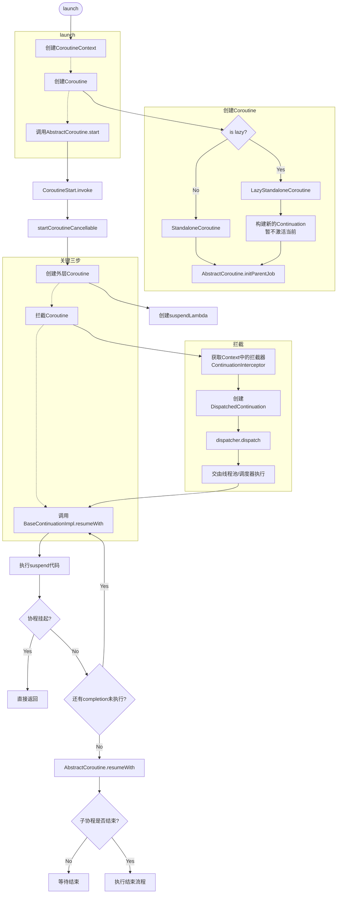

创建Context、Coroutine，并启动。

```kotlin
// Builder.common.kt
public fun CoroutineScope.launch(
    context: CoroutineContext = EmptyCoroutineContext,
    start: CoroutineStart = CoroutineStart.DEFAULT,
    block: suspend CoroutineScope.() -> Unit
): Job {
    val newContext = newCoroutineContext(context)
    val coroutine = if (start.isLazy)
        LazyStandaloneCoroutine(newContext, block) else
        StandaloneCoroutine(newContext, active = true)
    coroutine.start(start, coroutine, block)
    return coroutine
}

private open class StandaloneCoroutine(
    parentContext: CoroutineContext,
    active: Boolean
) : AbstractCoroutine<Unit>(parentContext, initParentJob = true, active = active) {
    override fun handleJobException(exception: Throwable): Boolean {
        handleCoroutineException(context, exception)
        return true
    }
}

private class LazyStandaloneCoroutine(
    parentContext: CoroutineContext,
    block: suspend CoroutineScope.() -> Unit
) : StandaloneCoroutine(parentContext, active = false) {
    private val continuation = block.createCoroutineUnintercepted(this, this)

    override fun onStart() {
        continuation.startCoroutineCancellable(this)
    }
}

```

调用`CoroutineStart`启动协程，默认是`CoroutineStart.DEFAULT`，其决定了不同的启动方式：

- DEFAULT： 默认值——根据上下文立即调度协程执行。
- LAZY： 延迟启动协程，只在需要时才启动。这里什么都没有做，主要是上面创建的`LazyStandaloneCoroutine`启动时再去启动协程
- ATOMIC：原子的——根据上下文安排协同程序的执行，与DEFAULT类似，但是其在启动之前不可取消。
- UNDISPATCHED： 立即执行协程，直到当前线程中的第一个挂起点(类似于使用 Dispatchers.Unconfined启动的协程)为止。

```kotlin
// AbstractCoroutine.kt
    public fun <R> start(start: CoroutineStart, receiver: R, block: suspend R.() -> T) {
        start(block, receiver, this)
    }

```

```kotlin
// CoroutineStart.kt
public enum class CoroutineStart {
    DEFAULT,
    LAZY,
    ATOMIC,
    UNDISPATCHED;
    public operator fun <T> invoke(block: suspend () -> T, completion: Continuation<T>): Unit =
        when (this) {
            DEFAULT -> block.startCoroutineCancellable(completion)
            ATOMIC -> block.startCoroutine(completion)
            UNDISPATCHED -> block.startCoroutineUndispatched(completion)
            LAZY -> Unit // will start lazily
        }
}
```

默认是`DEFAULT`方式启动，那么其执行`startCoroutineCancellable`方法。这个方法便是最主要的三步，首先通过`createCoroutineUnintercepted`创建一个`Continuation`,其`invokeSuspend`方法为最终执行我们传入的代码块的地方；`intercepted`则是选择`Context`中的拦截器；最后在`resumeCancellableWith`方法中调用上一步的拦截器来执行我们的代码块。

```kotlin
// Cancellable.kt
public fun <T> (suspend () -> T).startCoroutineCancellable(completion: Continuation<T>): Unit = runSafely(completion) {
    createCoroutineUnintercepted(completion).intercepted().resumeCancellableWith(Result.success(Unit))
}

private inline fun runSafely(completion: Continuation<*>, block: () -> Unit) {
    try {
        block()
    } catch (e: Throwable) {
        completion.resumeWith(Result.failure(e))
    }
}
```

`createCoroutineUnintercepted`方法参数`completion`是最开始创建的`StandaloneCoroutine`或者`LazyStandaloneCoroutine`，都不是`BaseContinuationImpl`，所以会直接调用`createCoroutineFromSuspendFunction`；在`createCoroutineFromSuspendFunction`中会创建`RestrictedContinuationImpl`或者`ContinuationImpl`，它们都继承自`BaseContinuationImpl`且都实现了`invokeSuspend`方法，使用状态机的方式调用我们编写在协程中的代码块。

`intercepted`方法选择一个`Continuation`来执行代码块，如果`context`为`EmptyCoroutineContext`，那么创建的是`RestrictedContinuationImpl`，则直接返回自身；如果如果`context`不为`EmptyCoroutineContext`，那么创建的是`ContinuationImpl`，这种情况下则会取`context`中`ContinuationInterceptor`为键保存的拦截器，并通过该拦截器创建一个可以执行通过拦截器来执行代码块的`DispatchedContinuation`。值得注意的是在协程上下文中，拦截器始终保存在`ContinuationInterceptor`键中，不管拦截器是如何实现的。

```kotlin
// IntrinsicsJvm.kt
public actual fun <T> (suspend () -> T).createCoroutineUnintercepted(
    completion: Continuation<T>
): Continuation<Unit> {
    val probeCompletion = probeCoroutineCreated(completion)
    return if (this is BaseContinuationImpl)
        create(probeCompletion)
    else
        createCoroutineFromSuspendFunction(probeCompletion) {
            (this as Function1<Continuation<T>, Any?>).invoke(it)
        }
}

private inline fun <T> createCoroutineFromSuspendFunction(
    completion: Continuation<T>,
    crossinline block: (Continuation<T>) -> Any?
): Continuation<Unit> {
    val context = completion.context
    // label == 0 when coroutine is not started yet (initially) or label == 1 when it was
    return if (context === EmptyCoroutineContext)
        object : RestrictedContinuationImpl(completion as Continuation<Any?>) {
            private var label = 0

            override fun invokeSuspend(result: Result<Any?>): Any? =
                when (label) {
                    0 -> {
                        label = 1
                        result.getOrThrow() // Rethrow exception if trying to start with exception (will be caught by BaseContinuationImpl.resumeWith
                        block(this) // run the block, may return or suspend
                    }
                    1 -> {
                        label = 2
                        result.getOrThrow() // this is the result if the block had suspended
                    }
                    else -> error("This coroutine had already completed")
                }
        }
    else
        object : ContinuationImpl(completion as Continuation<Any?>, context) {
            private var label = 0

            override fun invokeSuspend(result: Result<Any?>): Any? =
                when (label) {
                    0 -> {
                        label = 1
                        result.getOrThrow() // Rethrow exception if trying to start with exception (will be caught by BaseContinuationImpl.resumeWith
                        block(this) // run the block, may return or suspend
                    }
                    1 -> {
                        label = 2
                        result.getOrThrow() // this is the result if the block had suspended
                    }
                    else -> error("This coroutine had already completed")
                }
        }
}

// 如果是ContinuationImpl，则取context中的拦截器
public actual fun <T> Continuation<T>.intercepted(): Continuation<T> =
    (this as? ContinuationImpl)?.intercepted() ?: this
```

如果需要拦截，调用`ContinuationInterceptor.interceptContinuation`创建一个带拦截器的`DispatchedContinuation`。

```kotlin
// ContinuationImpl.kt
public fun intercepted(): Continuation<Any?> =
    intercepted
        ?: (context[ContinuationInterceptor]?.interceptContinuation(this) ?: this)
        	.also { intercepted = it }
```

```kotlin
// CoroutineDispatcher.kt
// Dispatchers.Default 
	public final override fun <T> interceptContinuation(continuation: Continuation<T>): Continuation<T> =
        DispatchedContinuation(this, continuation)
```

接着看第三步`resumeCancellableWith`方法，如果为`DispatchedContinuation`，则调用拦截器判断是否需要拦截，需要则调用拦截器去执行，后面详解；否则则调用之前继承自`BaseContinuationImpl`的`Continuation`的`resumeWith`方法。

```kotlin
// DispatchedContinuation.kt
public fun <T> Continuation<T>.resumeCancellableWith(
    result: Result<T>,
    onCancellation: ((cause: Throwable) -> Unit)? = null
): Unit = when (this) {
    is DispatchedContinuation -> resumeCancellableWith(result, onCancellation)
    else -> resumeWith(result)
}

internal class DispatchedContinuation<in T>(
    @JvmField val dispatcher: CoroutineDispatcher,
    @JvmField val continuation: Continuation<T>
) : DispatchedTask<T>(MODE_UNINITIALIZED), CoroutineStackFrame, Continuation<T> by continuation {
    ...
    
    inline fun resumeCancellableWith(
        result: Result<T>,
        noinline onCancellation: ((cause: Throwable) -> Unit)?
    ) {
        val state = result.toState(onCancellation)
        if (dispatcher.isDispatchNeeded(context)) {
            _state = state
            resumeMode = MODE_CANCELLABLE
            dispatcher.dispatch(context, this)
        } else {
            executeUnconfined(state, MODE_CANCELLABLE) {
                if (!resumeCancelled(state)) {
                    resumeUndispatchedWith(result)
                }
            }
        }
    }
}

```

协程中的拦截器有很多，比如`Dispatchers.Default`拦截器是`SchedulerCoroutineDispatcher`的实现类，`dispatch`则是委托给协程调度器（其实就是一个线程池）来执行`DispatchedContinuation`的父类`DispatchedTask`中的`run`方法。其他拦截器也大同小异，不再赘述。

```kotlin
// Dispatcher.kt
internal open class SchedulerCoroutineDispatcher(
    private val corePoolSize: Int = CORE_POOL_SIZE,
    private val maxPoolSize: Int = MAX_POOL_SIZE,
    private val idleWorkerKeepAliveNs: Long = IDLE_WORKER_KEEP_ALIVE_NS,
    private val schedulerName: String = "CoroutineScheduler",
) : ExecutorCoroutineDispatcher() {

    // This is variable for test purposes, so that we can reinitialize from clean state
    private var coroutineScheduler = createScheduler()

    private fun createScheduler() =
        CoroutineScheduler(corePoolSize, maxPoolSize, idleWorkerKeepAliveNs, schedulerName)

    override fun dispatch(context: CoroutineContext, block: Runnable): Unit = coroutineScheduler.dispatch(block)
	...
}
```

在`CoroutineScheduler`中其实就是将任务添加到`localQueue`中。

```kotlin
// CoroutineScheduler.kt
    fun dispatch(block: Runnable, taskContext: TaskContext = NonBlockingContext, tailDispatch: Boolean = false) {
        trackTask() // this is needed for virtual time support
        val task = createTask(block, taskContext)
        // try to submit the task to the local queue and act depending on the result
        val currentWorker = currentWorker()
        val notAdded = currentWorker.submitToLocalQueue(task, tailDispatch)
        if (notAdded != null) {
            if (!addToGlobalQueue(notAdded)) {
                // Global queue is closed in the last step of close/shutdown -- no more tasks should be accepted
                throw RejectedExecutionException("$schedulerName was terminated")
            }
        }
        val skipUnpark = tailDispatch && currentWorker != null
        // Checking 'task' instead of 'notAdded' is completely okay
        if (task.mode == TASK_NON_BLOCKING) {
            if (skipUnpark) return
            signalCpuWork()
        } else {
            // Increment blocking tasks anyway
            signalBlockingWork(skipUnpark = skipUnpark)
        }
    }
    private fun Worker?.submitToLocalQueue(task: Task, tailDispatch: Boolean): Task? {
        if (this == null) return task
        /*
         * This worker could have been already terminated from this thread by close/shutdown and it should not
         * accept any more tasks into its local queue.
         */
        if (state === WorkerState.TERMINATED) return task
        // Do not add CPU tasks in local queue if we are not able to execute it
        if (task.mode == TASK_NON_BLOCKING && state === WorkerState.BLOCKING) {
            return task
        }
        mayHaveLocalTasks = true
        return localQueue.add(task, fair = tailDispatch)
    }
```

拦截器最终会执行到`DispatchedTask`中的run方法，在这里最终会调用`continuation.resume`回到`BaseContinuationImpl`的`resumeWith`方法中，与上面不经过拦截器执行殊途同归。

```kotlin
// DispatchedTask.kt
	public final override fun run() {
        assert { resumeMode != MODE_UNINITIALIZED } // should have been set before dispatching
        val taskContext = this.taskContext
        var fatalException: Throwable? = null
        try {
            val delegate = delegate as DispatchedContinuation<T>
            val continuation = delegate.continuation
            withContinuationContext(continuation, delegate.countOrElement) {
                val context = continuation.context
                val state = takeState() // NOTE: Must take state in any case, even if cancelled
                val exception = getExceptionalResult(state)
                /*
                 * Check whether continuation was originally resumed with an exception.
                 * If so, it dominates cancellation, otherwise the original exception
                 * will be silently lost.
                 */
                val job = if (exception == null && resumeMode.isCancellableMode) context[Job] else null
                if (job != null && !job.isActive) {
                    val cause = job.getCancellationException()
                    cancelCompletedResult(state, cause)
                    continuation.resumeWithStackTrace(cause)
                } else {
                    if (exception != null) {
                        continuation.resumeWithException(exception)
                    } else {
                        continuation.resume(getSuccessfulResult(state))
                    }
                }
            }
        } catch (e: Throwable) {
            // This instead of runCatching to have nicer stacktrace and debug experience
            fatalException = e
        } finally {
            val result = runCatching { taskContext.afterTask() }
            handleFatalException(fatalException, result.exceptionOrNull())
        }
    }

// Continuation.kt
public inline fun <T> Continuation<T>.resume(value: T): Unit =
    resumeWith(Result.success(value))
```

`BaseContinuationImpl`如同链表一样，其`completion`指向下一个`Continuation`，`resumeWith`方法会将所有`completion`为`BaseContinuationImpl`取出来，然后执行`invokeSuspend`方法，`invokeSuspend`方法在上面`RestrictedContinuationImpl`和`ContinuationImpl`都实现了，他就是一个状态机，每次执行的时候`label`会增加，然后根据其状态执行不同的逻辑。如果`invokeSuspend`返回了挂起协程`COROUTINE_SUSPENDED`，比如遇到`delay`方法，那么会直接返回。执行完毕之后最终回调用最开始创建的`StandaloneCoroutine`或者`LazyStandaloneCoroutine`的父类`AbstractCoroutine`中`resumeWith`方法。

```kotlin
// ContinuationImpl.kt
    public final override fun resumeWith(result: Result<Any?>) {
        // This loop unrolls recursion in current.resumeWith(param) to make saner and shorter stack traces on resume
        var current = this
        var param = result
        while (true) {
            // Invoke "resume" debug probe on every resumed continuation, so that a debugging library infrastructure
            // can precisely track what part of suspended callstack was already resumed
            probeCoroutineResumed(current)
            with(current) {
                val completion = completion!! // fail fast when trying to resume continuation without completion
                val outcome: Result<Any?> =
                    try {
                        val outcome = invokeSuspend(param)
                        if (outcome === COROUTINE_SUSPENDED) return
                        Result.success(outcome)
                    } catch (exception: Throwable) {
                        Result.failure(exception)
                    }
                releaseIntercepted() // this state machine instance is terminating
                if (completion is BaseContinuationImpl) {
                    // unrolling recursion via loop
                    current = completion
                    param = outcome
                } else {
                    // top-level completion reached -- invoke and return
                    completion.resumeWith(outcome)
                    return
                }
            }
        }
    }
```

这里等待所有的子协程都结束之后，然后结束当前协程。

```kotlin
// AbstractCoroutine.kt
public abstract class AbstractCoroutine<in T>(
    parentContext: CoroutineContext,
    initParentJob: Boolean,
    active: Boolean
) : JobSupport(active), Job, Continuation<T>, CoroutineScope {
    ...
    public final override fun resumeWith(result: Result<T>) {
        // 1. 获取当前协程的技术状态
        val state = makeCompletingOnce(result.toState())
        // 2. 如果当前还在等待完成，说明还有子协程没有结束
        if (state === COMPLETING_WAITING_CHILDREN) return
         // 3. 执行结束恢复的方法，默认为空
        afterResume(state)
    }
}
```


```kotlin
// JobSupport.kt
	internal fun makeCompletingOnce(proposedUpdate: Any?): Any? {
        loopOnState { state ->
             // tryMakeCompleting 的内容主要根据是否有子Job做不同处理
            val finalState = tryMakeCompleting(state, proposedUpdate)
            when {
                finalState === COMPLETING_ALREADY ->
                    throw IllegalStateException(
                        "Job $this is already complete or completing, " +
                            "but is being completed with $proposedUpdate", proposedUpdate.exceptionOrNull
                    )
                finalState === COMPLETING_RETRY -> return@loopOnState
                else -> return finalState // COMPLETING_WAITING_CHILDREN or final state
            }
        }
    }
```


### 参考文档

1. [抽丝剥茧Kotlin - 协程](https://juejin.cn/post/6862548590092140558#heading-17)
