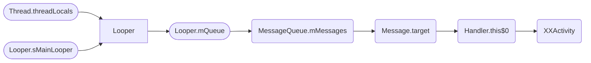

# 内存泄漏问题


### 一、什么是内存泄漏？

内存泄漏（Memory Leak）是指程序中已动态分配的堆内存由于某种原因程序未释放或无法释放，造成系统内存的浪费，导致程序运行速度减慢甚至系统崩溃等严重后果（转自百度百科）。或者说是短周期对象在其生命周期结束后，仍被长周期对象引用，导致其无法对释放。

众所周知 Java 会自动回收废弃对象，那么哪些对象是废弃对象，怎么判断其能够被回收？

在 JVM 中是通过**可达性分析算法**来决定对象是否可以回收。具体做法就是把内存中所有对象之间的引用关系看做一条关系链，比如A持有B的引用，B持有C的引用。而在JVM中有一组对象作为GC Root，也就是根节点，然后从这些节点开始往下搜索，查看引用链，最后判断对象的引用链是否可达来决定对象是否可以被回收。

**可以作为 gc root 的对象**

> 引用自《深入理解 Java 虚拟机》:
>
> 1、在虚拟机栈(栈帧中的本地变量表)，譬如各个线程被调用的方法堆栈中使用到的参数、局部变量、临时变量等。
>
> 2、在方法区中类静态属性引用的对象，譬如 java 类的引用类型静态变量。
>
> 3、在方法区中常量引用的对象，譬如字符串常量池里的引用。
>
> 4、在本地方法栈中 JNI 引用的对象。
>
> 5、Java 虚拟机内部的引用，如基本数据类型对应的 class 对象，一些常驻的异常对象等，还有类加载器。
>
> 6、所有被同步锁持有的对象。
>
> 7、反映 Java 虚拟机内部情况的 JMXBean、JVMTI 中注册的回调、本地代码缓存等。

### 二、内存泄漏示例

比如，我们在 XXActivity 创建一个Handler，然后通过这个handler发送一个20s延迟消息，然后结束 XXActivity，这时 XXActivity 就发生了内存泄漏。

```
    private Handler handler = new Handler(Looper.getMainLooper()){
        @Override
        public void handleMessage(@NonNull Message msg) {
            super.handleMessage(msg);
            Log.d(TAG, "handleMessage: " + msg);
        }
    };
```

其引用链是这样的：



当我们创建 Handler 的内部类时，其this$0会指向我们外部类（界面）；


使用 Handler 发送 Message，Message 的 target 属性会指向该 Handler；发送 Message 之后，Message 会被添加到 Looper 的 MessageQueue 中，直到20s之后消息被执行才会被移除 MessageQueue 中；

```java
// Handler.java
private boolean enqueueMessage(@NonNull MessageQueue queue, @NonNull Message msg,
                               long uptimeMillis) {
    // target指向Handler
    msg.target = this;
    msg.workSourceUid = ThreadLocalWorkSource.getUid();

    if (mAsynchronous) {
        msg.setAsynchronous(true);
    }
    return queue.enqueueMessage(msg, uptimeMillis);
}
```

当Looper执行 prepareMainLooper 方法后，主线程的 Looper 会被 Looper 类中的静态变量 sMainLooper 一直持有 ，另外当前线程的 threadLocals（ThreadLocal.ThreadLocalMap）属性也会持有Looper引用；

```java
// Looper.java
public static void prepareMainLooper() {
    prepare(false);
    synchronized (Looper.class) {
        if (sMainLooper != null) {
            throw new IllegalStateException("The main Looper has already been prepared.");
        }
        // 静态变量sMainLooper持有主线程Looper引用
        sMainLooper = myLooper();
    }
}

private static void prepare(boolean quitAllowed) {
    if (sThreadLocal.get() != null) {
        throw new RuntimeException("Only one Looper may be created per thread");
    }
    // 将Looper对象添加到ThreadLocal中
    sThreadLocal.set(new Looper(quitAllowed));
}
```

到此便形成了一条完成的引用链，其中`Looper.sMainLooper`和`Thread.threadLocals`都是GC Root，他们分辨满足上面提到的 GC Root条件的第二条和第一条。


### 三、内存泄漏排查工具

常见的内存泄漏排查工具有很多，比如 LeakCanary 、Android Studio自带的Profiler或者MAT(Memory Analyzer Tool)。

1. 使用LeakCanary排查

[LeakCanary](https://github.com/square/leakcanary) 是可以直接集成在 APP 中，当Activity/ Fragment结束时会触发内存泄漏检查，一旦发现存在内存泄漏，会发送通知告知。

```groovy
dependencies {
  // debugImplementation because LeakCanary should only run in debug builds.
  debugImplementation 'com.squareup.leakcanary:leakcanary-android:2.8.1'
}
```


2. 使用Profiler排查

(1). 打开Android Profiler，并连接对应的进程


(2). 选择Memory，并dump内存


(3). 如果发生了内存泄漏就能发现上面标明了“xx Leaks”，点击其中一项，并查看其对应的引用（References），找到最短引用路径，其大概率便是导致内存泄漏的地方，然后一一排查对应的地方即可。

比如下图为百度地图sdk 9.2.9导致发生的内存泄漏，其MapController.f（MapRenderModeChangeListener）一直持有JobDetailSlideActivity的引用，导致该页面一直无法释放。后来在对应界面destroy时，手动将f对象置空之后便不再出现内存泄漏了。


### 四、解决内存泄漏

解决内存泄漏的办法殊途同归，关键就是不要让长生命周期对象持有在生命周期结束之后的短生命周期对象的引用。

1. 如果无法确定对象的生命周期或者存活状态，可以使用弱引用替换强引用

> `强引用`就是对象被强引用后，无论如何都不会被回收。
> `弱引用`就是在垃圾回收时，如果这个对象只被弱引用关联（没有任何强引用关联他），那么这个对象就会被回收。
> `软引用`就是在系统将发生内存溢出的时候，回进行回收。
> `虚引用`是对象完全不会对其生存时间构成影响，也无法通过虚引用来获取对象实例，用的比较少。

2. 内部类写成静态类或者外部类，转化为静态类或者外部类之后就不会默认就持有之前的外部类的引用了，如果非要用外部类，那么将其改为弱引用

3. 在短周期对象生命周期结束的时候移除长周期对象对其的引用


### 参考文档

1. [百度百科——内存泄漏](https://baike.baidu.com/item/%E5%86%85%E5%AD%98%E6%B3%84%E6%BC%8F/6181425)
2. [简述内存泄露的“真相”](https://mp.weixin.qq.com/s/EOLuqtrUhSRcLeCrFiWnnA)
3. [小题大做 | 内存泄漏简单问，你能答对吗](https://juejin.cn/post/6909362503898595342)
