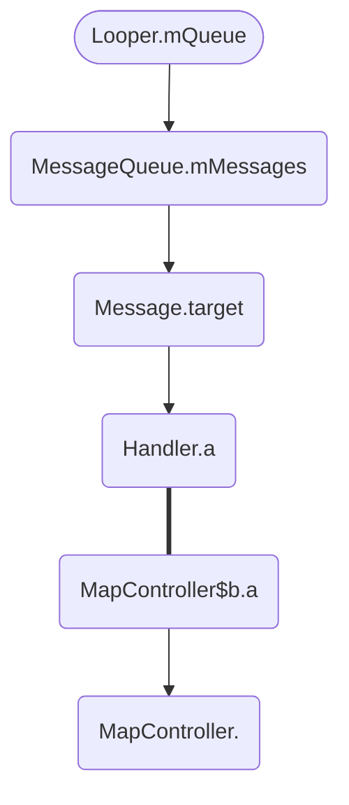

# 百度地图内存泄漏问题

近日同事反馈他使用我们app打开十多个页面之后就会崩溃。这种情况大概率是内存泄漏导致内存增长，直到内存溢出了。于是打开Android Studio的Profiler工具查看内存情况，dump内存下来分析

### 什么是内存泄漏？

内存泄漏（Memory Leak）是指程序中已动态分配的堆内存由于某种原因程序未释放或无法释放，造成系统内存的浪费，导致程序运行速度减慢甚至系统崩溃等严重后果。（转自百度百科）

众所周知 Java 会自动回收废弃对象，那么哪些对象是废弃对象，可以被回收？

在 JVM 中是通过**可达性分析算法**来决定对象是否可以回收。具体做法就是把内存中所有对象之间的引用关系看做一条关系链，比如A持有B的引用，B持有C的引用。而在JVM中有一组对象作为GC Root，也就是根节点，然后从这些节点开始往下搜索，查看引用链，最后判断对象的引用链是否可达来决定对象是否可以被回收。

**可以作为 gc root 的对象**

> 引用自《深入理解 Java 虚拟机》:
>
> 1、在虚拟机栈(栈帧中的本地变量表)，譬如各个线程被调用的方法堆栈中使用到的参数、局部变量、临时变量等。
>
> 2、在方法区中类静态属性引用的对象，譬如 java 类的引用类型静态变量。
>
> 3、在方法区中常量引用的对象，譬如字符串常量池里的引用。
>
> 4、在本地方法栈中 JNI 引用的对象。
>
> 5、Java 虚拟机内部的引用，如基本数据类型对应的 class 对象，一些常驻的异常对象等，还有类加载器。
>
> 6、所有被同步锁持有的对象。
>
> 7、反映 Java 虚拟机内部情况的 JMXBean、JVMTI 中注册的回调、本地代码缓存等。

在 Android 中

在Java中，不再使用的对象会在GC时自动回收并释放。当一些不再使用的对象一直被强引用，导致其无法释放，这种情况就是内存泄漏。

### 参考文档

1. [百度百科——内存泄漏](https://baike.baidu.com/item/%E5%86%85%E5%AD%98%E6%B3%84%E6%BC%8F/6181425)
2. [简述内存泄露的“真相”](https://mp.weixin.qq.com/s/EOLuqtrUhSRcLeCrFiWnnA)
3. [小题大做 | 内存泄漏简单问，你能答对吗](https://juejin.cn/post/6909362503898595342)
