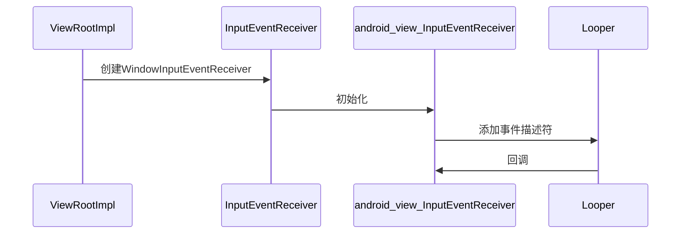

# 安卓事件传递机制

```mermaid
sequenceDiagram
ViewRootImpl ->> InputEventReceiver:创建WindowInputEventReceiver
InputEventReceiver ->> android_view_InputEventReceiver: 初始化
android_view_InputEventReceiver ->> Looper: 添加事件描述符

Looper ->> android_view_InputEventReceiver: 回调


```

### 参考文档

1. [select/poll/epoll对比分析](http://gityuan.com/2015/12/06/linux_epoll/)