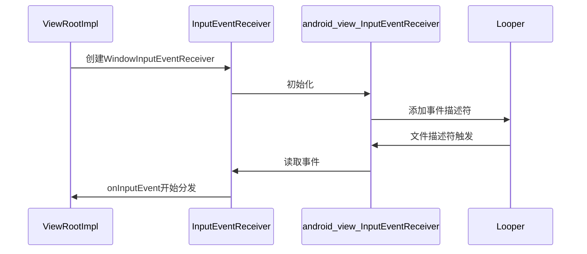

# 安卓事件是如果传递给ViewRootImpl分发的

概述：





### 一、注册事件接收器

这一部分主要介绍将事件和回调方法注册到Looper中。

#### 1. 创建`InputEventReceiver`

首先在`ViewRooImpl.setView`里面判断窗口是否需要接收事件，如果需要输入事件则创建`InputChannel`，然后使用该`inputChannel`和当前`Looper`创建新的 内部类（`WindowInputEventReceiver`）`mInputEventReceiver`实例，当接收到事件会调用其`onInputEvent(InputEvent event)`方法，`ViewRootImpl`就是从这里开始处理事件。

```java
//ViewRootImpl.java
	public void setView(View view, WindowManager.LayoutParams attrs, View panelParentView,
                        int userId) {
        ...
        // 创建InputChannel
        InputChannel inputChannel = null;
        if ((mWindowAttributes.inputFeatures
             & WindowManager.LayoutParams.INPUT_FEATURE_NO_INPUT_CHANNEL) == 0) {
            inputChannel = new InputChannel();
        }
        ...
        if (inputChannel != null) {
            if (mInputQueueCallback != null) {
                mInputQueue = new InputQueue();
                mInputQueueCallback.onInputQueueCreated(mInputQueue);
            }
            // 创建事件接收器，native方法出来第一个调用的就是它的`void dispatchInputEvent(int seq, InputEvent event)`方法
            mInputEventReceiver = new WindowInputEventReceiver(inputChannel,
                                                               Looper.myLooper());
        }
        ...
        try {
            ...
            // 这里将inputChannel传递到WindowManagerService，然后再调用InputManagerService进行socket配对连接，
            // 事件发生后会向inputChannel写入事件数据
            res = mWindowSession.addToDisplayAsUser(mWindow, mWindowAttributes,
                                                    getHostVisibility(), mDisplay.getDisplayId(), userId,
                                                    mInsetsController.getRequestedVisibility(), inputChannel, mTempInsets,
                                                    mTempControls);
        } catch (RemoteException e) {
			...
            throw new RuntimeException("Adding window failed", e);
        } 
        ...
        // 构建输入事件处理责任链
        CharSequence counterSuffix = attrs.getTitle();
        mSyntheticInputStage = new SyntheticInputStage();
        InputStage viewPostImeStage = new ViewPostImeInputStage(mSyntheticInputStage);
        InputStage nativePostImeStage = new NativePostImeInputStage(viewPostImeStage,
                                                                    "aq:native-post-ime:" + counterSuffix);
        InputStage earlyPostImeStage = new EarlyPostImeInputStage(nativePostImeStage);
        InputStage imeStage = new ImeInputStage(earlyPostImeStage,
                                                "aq:ime:" + counterSuffix);
        InputStage viewPreImeStage = new ViewPreImeInputStage(imeStage);
        InputStage nativePreImeStage = new NativePreImeInputStage(viewPreImeStage,
                                                                  "aq:native-pre-ime:" + counterSuffix);

        mFirstInputStage = nativePreImeStage;
        mFirstPostImeInputStage = earlyPostImeStage;
        mPendingInputEventQueueLengthCounterName = "aq:pending:" + counterSuffix;
  
	}

```

`WindowInputEventReceiver`继承自`InputEventReceiver`，创建`WindowInputEventReceiver`实例时，就会调用`InputEventReceiver`的初始化方法，`InputEventReceiver`接收到事件，会回调到`onInputEvent`方法。

```java
//WindowInputEventReceiver.java
    final class WindowInputEventReceiver extends InputEventReceiver {
        public WindowInputEventReceiver(InputChannel inputChannel, Looper looper) {
            super(inputChannel, looper);
        }

        @Override
        public void onInputEvent(InputEvent event) {
            Trace.traceBegin(Trace.TRACE_TAG_VIEW, "processInputEventForCompatibility");
            List<InputEvent> processedEvents;
            try {
                processedEvents =
                    mInputCompatProcessor.processInputEventForCompatibility(event);
            } finally {
                Trace.traceEnd(Trace.TRACE_TAG_VIEW);
            }
            if (processedEvents != null) {
                if (processedEvents.isEmpty()) {
                    // InputEvent consumed by mInputCompatProcessor
                    finishInputEvent(event, true);
                } else {
                    for (int i = 0; i < processedEvents.size(); i++) {
                        enqueueInputEvent(
                                processedEvents.get(i), this,
                                QueuedInputEvent.FLAG_MODIFIED_FOR_COMPATIBILITY, true);
                    }
                }
            } else {
                enqueueInputEvent(event, this, 0, true);
            }
        }

        @Override
        public void onBatchedInputEventPending(int source) {
            // mStopped: There will be no more choreographer callbacks if we are stopped,
            // so we must consume all input immediately to prevent ANR
            final boolean unbuffered = mUnbufferedInputDispatch
                    || (source & mUnbufferedInputSource) != SOURCE_CLASS_NONE
                    || mStopped;
            if (unbuffered) {
                if (mConsumeBatchedInputScheduled) {
                    unscheduleConsumeBatchedInput();
                }
                // Consume event immediately if unbuffered input dispatch has been requested.
                consumeBatchedInputEvents(-1);
                return;
            }
            scheduleConsumeBatchedInput();
        }

        @Override
        public void onFocusEvent(boolean hasFocus, boolean inTouchMode) {
            windowFocusChanged(hasFocus, inTouchMode);
        }

        @Override
        public void dispose() {
            unscheduleConsumeBatchedInput();
            super.dispose();
        }
    }
```

#### 2. 初始化

创建`InputEventReceiver`调用了native方法`nativeInit`，`nativeInit`在`android_view_InputEventReceiver.cpp`中。

```java
// InputEventReceiver.java
public abstract class InputEventReceiver {
  
    private static native long nativeInit(WeakReference<InputEventReceiver> receiver,
            InputChannel inputChannel, MessageQueue messageQueue);
	...
  
    public InputEventReceiver(InputChannel inputChannel, Looper looper) {
        ...
        mInputChannel = inputChannel;
        mMessageQueue = looper.getQueue();
        // 调用nativeInit方法初始化
        mReceiverPtr = nativeInit(new WeakReference<InputEventReceiver>(this),
                inputChannel, mMessageQueue);

        mCloseGuard.open("dispose");
    }
  
}
```

在`nativeInit`方法中，首先获取在JVM中创建的`inputChannel`和`messageQueue`实例，然后创建`NativeInputEventReceiver`，并调用其`initialize`方法，之后会向Looper中添加`InputChannel`的文件描述符，监听`ALOOPER_EVENT_INPUT`事件，回调为`NativeInputEventReceiver`自己，即`NativeInputEventReceiver::handleEvent(int receiveFd, int events, void* data)`方法。

```c++
// frameworks\base\core\jni\android_view_InputEventReceiver.cpp
static jlong nativeInit(JNIEnv* env, jclass clazz, jobject receiverWeak,
        jobject inputChannelObj, jobject messageQueueObj) {
    // 获取JVM中的inputChannel对象
    sp<InputChannel> inputChannel = android_view_InputChannel_getInputChannel(env,
            inputChannelObj);
    if (inputChannel == nullptr) {
        jniThrowRuntimeException(env, "InputChannel is not initialized.");
        return 0;
    }
    // 获取JVM中的messageQueue对象
    sp<MessageQueue> messageQueue = android_os_MessageQueue_getMessageQueue(env, messageQueueObj);
    if (messageQueue == nullptr) {
        jniThrowRuntimeException(env, "MessageQueue is not initialized.");
        return 0;
    }
	//创建输入事件接收器
    sp<NativeInputEventReceiver> receiver = new NativeInputEventReceiver(env,
            receiverWeak, inputChannel, messageQueue);
    // 调用initialize方法
    status_t status = receiver->initialize();
    if (status) {
        String8 message;
        message.appendFormat("Failed to initialize input event receiver.  status=%d", status);
        jniThrowRuntimeException(env, message.string());
        return 0;
    }

    receiver->incStrong(gInputEventReceiverClassInfo.clazz); // retain a reference for the object
    return reinterpret_cast<jlong>(receiver.get());
}

status_t NativeInputEventReceiver::initialize() {
    // 添加输入事件
    setFdEvents(ALOOPER_EVENT_INPUT);
    return OK;
}

void NativeInputEventReceiver::setFdEvents(int events) {
    if (mFdEvents != events) {
        mFdEvents = events;
        // 这里Channel即为之前创建的InputChannel
        int fd = mInputConsumer.getChannel()->getFd();
        if (events) {
            // 将事件添加到Looper中，等待事件唤醒，回调设置为this，即为NativeInputEventReceiver.handleEvent方法
            mMessageQueue->getLooper()->addFd(fd, 0, events, this, nullptr);
        } else {
            mMessageQueue->getLooper()->removeFd(fd);
        }
    }
}
int NativeInputEventReceiver::handleEvent(int receiveFd, int events, void* data) {
 // 详细代码后文再介绍  
}
```

#### 3. 添加事件监听文件描述符

在`addFd`方法中，首先创建`request`实例，将文件描述符、回调、额外参数等都封装进去，然后判断是否已经存在该文件描述符，如果不存在使用`epoll_ctl`方法添加新的监听事件，如果存在则替换为新的监听事件。

> Request实例属性说明：
> fd：文件描述符
> indent：后文`pollOnce`方法的返回值
> events：事件标志，包括ALOOPER_EVENT_INPUT（1）、ALOOPER_EVENT_OUTPUT（2）、ALOOPER_EVENT_ERROR（4）、ALOOPER_EVENT_HANGUP（8）、ALOOPER_EVENT_INVALID（16）
> callback：回调方法
> data： 执行回调方法时传入的参数

> `epoll_ctl`用于对需要监听的文件描述符(fd)执行op操作，比如将fd加入到epoll句柄，详细请查看 [select/poll/epoll对比分析](http://gityuan.com/2015/12/06/linux_epoll/)

```c++
// 之前的代码都是在framework中，后面代码都是在system中
// \system\core\libutils\Looper.cpp
int Looper::addFd(int fd, int ident, int events, Looper_callbackFunc callback, void* data) {
    return addFd(fd, ident, events, callback ? new SimpleLooperCallback(callback) : nullptr, data);
}

int Looper::addFd(int fd, int ident, int events, const sp<LooperCallback>& callback, void* data) {
    ...
    { // acquire lock
        AutoMutex _l(mLock);
        // WAKE_EVENT_FD_SEQ是给WakeEventFd的保留序列号.
        if (mNextRequestSeq == WAKE_EVENT_FD_SEQ) mNextRequestSeq++;
        // 序列号递增
        const SequenceNumber seq = mNextRequestSeq++;

        // 将文件描述符，回调等信息封装到request中
        Request request;
        request.fd = fd;
        request.ident = ident;
        request.events = events;
        request.callback = callback;
        request.data = data;

        epoll_event eventItem = createEpollEvent(request.getEpollEvents(), seq);
        auto seq_it = mSequenceNumberByFd.find(fd);
        if (seq_it == mSequenceNumberByFd.end()) {
            // 如果没有没有添加过该文件描述符，则添加一个
            int epollResult = epoll_ctl(mEpollFd.get(), EPOLL_CTL_ADD, fd, &eventItem);
            if (epollResult < 0) {
                ALOGE("Error adding epoll events for fd %d: %s", fd, strerror(errno));
                return -1;
            }
            // 将请求添加到map中
            mRequests.emplace(seq, request);
            mSequenceNumberByFd.emplace(fd, seq);
        } else {
            // 如果已经添加了该文件描述符，则修改
            int epollResult = epoll_ctl(mEpollFd.get(), EPOLL_CTL_MOD, fd, &eventItem);
            if (epollResult < 0) {
                // 这里检查是否修改成功，如果没有成功会重新创建epoll
                if (errno == ENOENT) {
                    // 上面如果发生了ENOENT错误，那么可能旧的文件描述符没有被正常移除，其回调方法也未能取消注册，
                    // 但是又重新创建了一个相同标识的文件描述符。当该文件描述符关闭时，可能导致旧的回调方法无法正常取消注册。
                    // 这里重新添加来做检查，进一步确保竞争是良性的。
                    //
                    // 但是由于内核限制，发生了上面的错误之后，无法移除之前不再生效的文件描述符，因此这里只能选择重新创建一个新的epoll
                    // 如果我们使用poll代替epoll是没有这种问题的，但是这种方法又有其他缺点。
                    epollResult = epoll_ctl(mEpollFd.get(), EPOLL_CTL_ADD, fd, &eventItem);
                    if (epollResult < 0) {
                        ALOGE("Error modifying or adding epoll events for fd %d: %s",
                                fd, strerror(errno));
                        return -1;
                    }
                    // 设置需要重新创建，将mEpollRebuildRequired设置为true
                    scheduleEpollRebuildLocked();
                } else {
                    ALOGE("Error modifying epoll events for fd %d: %s", fd, strerror(errno));
                    return -1;
                }
            }
            // 移除旧的请求，添加新的
            const SequenceNumber oldSeq = seq_it->second;
            mRequests.erase(oldSeq);
            mRequests.emplace(seq, request);
            seq_it->second = seq;
        }
    } // release lock
    return 1;
}
```

### 二、事件回调

> 这一部分主要介绍从Looper回调事件到ViewRootImpl

看过`Handler`源码的肯定都知道，在`Looper.loop`中会调用`MessageQueue.next`方法，而`next`中会调用`nativePollOnce`方法阻塞线程，直到被唤醒之后再执行下一个消息。下面就开始从`nativePollOnce`方法开始欣赏源码。

在`android_os_MessageQueue.cpp`中，`nativePollOnce`方法最终会调用`Looper.pollOnce`方法。

```c++
// frameworks\base\core\jni\android_os_MessageQueue.cpp
static void android_os_MessageQueue_nativePollOnce(JNIEnv* env, jobject obj,
        jlong ptr, jint timeoutMillis) {
    NativeMessageQueue* nativeMessageQueue = reinterpret_cast<NativeMessageQueue*>(ptr);
    nativeMessageQueue->pollOnce(env, obj, timeoutMillis);
}

void NativeMessageQueue::pollOnce(JNIEnv* env, jobject pollObj, int timeoutMillis) {
    mPollEnv = env;
    mPollObj = pollObj;
    // 调用Looper中的pollOnce方法
    mLooper->pollOnce(timeoutMillis);
    mPollObj = NULL;
    mPollEnv = NULL;

    if (mExceptionObj) {
        env->Throw(mExceptionObj);
        env->DeleteLocalRef(mExceptionObj);
        mExceptionObj = NULL;
    }
}
```

在`pollOnce`方法中，可以看到一个死循环的for语句，然后在`mResponses`里面查找可以返回的响应数据，返回上文提到过的`ident`（如果需要`data`数据的话也会返回上文request中的data）。看到这里我们可以猜测下文代码肯定是在触发事件之后，将数据封装成`Response`并保存到`mResponses`中。最后会调用`pollInner`方法，并且会判断其返回值是否不等于0，并返回。

```c++
// system\core\libutils\include\utils\Looper.h
int pollOnce(int timeoutMillis, int* outFd, int* outEvents, void** outData);
inline int pollOnce(int timeoutMillis) {
    return pollOnce(timeoutMillis, nullptr, nullptr, nullptr);
}
```

```c++
// system\core\libutils\Looper.cpp
int Looper::pollOnce(int timeoutMillis, int* outFd, int* outEvents, void** outData) {
    int result = 0;
    for (;;) {
        // 查找已经处理好了的响应数据并返回
        while (mResponseIndex < mResponses.size()) {
            const Response& response = mResponses.itemAt(mResponseIndex++);
            int ident = response.request.ident;
            if (ident >= 0) {
                int fd = response.request.fd;
                int events = response.events;
                void* data = response.request.data;

                if (outFd != nullptr) *outFd = fd;
                if (outEvents != nullptr) *outEvents = events;
                if (outData != nullptr) *outData = data;
                return ident;
            }
        }
		// 判断pollInner返回值是否不为0，如果不为0则返回
        if (result != 0) {
            if (outFd != nullptr) *outFd = 0;
            if (outEvents != nullptr) *outEvents = 0;
            if (outData != nullptr) *outData = nullptr;
            return result;
        }

        result = pollInner(timeoutMillis);
    }
}
```

接下来便是最关键的方法`pollInner`，这里会设计到`MessageQueue`消息唤醒，也比较重要，所以我没有删除额外代码，如果不想查看冗余代码，可以直接看①②③标记的代码处。

①处：在第一处可以看到调用了epoll的事件等待方法，当输入事件文件描述符收到数据就会被唤醒，也就是说`InputChannel`中收到数据之后会被唤醒；

②处：除开保留的文件描述符外，所有的事件都会走②处，包括输入事件，在这里会根据从`mRequests`中找到对应的请求数据，然后处理事件结果，并将数据封装成Response并添加到`mResponses`中；

③处：这里会从`mResponses`中取出请求数据，然后调用`addFd`时添加的回调方法，并且会把响应的event和传入的`data`回调回去。如果回调方法返回0的话，那么会移除该文件描述符监听。


```c++
// system\core\libutils\Looper.cpp

int Looper::pollInner(int timeoutMillis) {
    // 下一条消息执行需要延迟的时间和传入的延迟时间比较，取较小延迟时间
    if (timeoutMillis != 0 && mNextMessageUptime != LLONG_MAX) {
        nsecs_t now = systemTime(SYSTEM_TIME_MONOTONIC);
        int messageTimeoutMillis = toMillisecondTimeoutDelay(now, mNextMessageUptime);
        if (messageTimeoutMillis >= 0
                && (timeoutMillis < 0 || messageTimeoutMillis < timeoutMillis)) {
            timeoutMillis = messageTimeoutMillis;
        }
    }

    // 在pollOnce里面已经将mResponses全部取出执行了，这里直接清空
    int result = POLL_WAKE;
    mResponses.clear();
    mResponseIndex = 0;

    // 设置空闲状态，或者说是会被阻塞了
    mPolling = true;

    // ① 等待事件唤醒
    // 等待事件唤醒，epoll_wait具体用法查看http://gityuan.com/2015/12/06/linux_epoll/
    struct epoll_event eventItems[EPOLL_MAX_EVENTS];
    int eventCount = epoll_wait(mEpollFd.get(), eventItems, EPOLL_MAX_EVENTS, timeoutMillis);

    // 取消设置空闲状态，或者是阻塞结束
    mPolling = false;

    // Acquire lock.
    mLock.lock();

    // 在addFd提到的可能出错，需要重新创建epoll
    if (mEpollRebuildRequired) {
        mEpollRebuildRequired = false;
        rebuildEpollLocked();
        goto Done;
    }

    // 检查poll出错
    if (eventCount < 0) {
        if (errno == EINTR) {
            goto Done;
        }
        ALOGW("Poll failed with an unexpected error: %s", strerror(errno));
        result = POLL_ERROR;
        goto Done;
    }

    // 检查超时
    if (eventCount == 0) {
        result = POLL_TIMEOUT;
        goto Done;
    }

    // 取出所有事件，并进行处理
    for (int i = 0; i < eventCount; i++) {
        const SequenceNumber seq = eventItems[i].data.u64;
        uint32_t epollEvents = eventItems[i].events;
        if (seq == WAKE_EVENT_FD_SEQ) {
            // WAKE_EVENT_FD_SEQ是我们保留值，用于主动唤醒的，比如向MessageQueue中添加了消息，就会唤醒
            if (epollEvents & EPOLLIN) {
                // 调用awoken方法去将其中的数据读取掉，方便后面再写入
                awoken();
            } else {
                ALOGW("Ignoring unexpected epoll events 0x%x on wake event fd.", epollEvents);
            }
        } else {
            // ② 取出事件，并添加到到mResponses中
            // 到这里的事件是我们自定义添加事件（addFd），比如上文提到的输入事件，当InputChannel收到数据时就会唤醒
            const auto& request_it = mRequests.find(seq);
            if (request_it != mRequests.end()) {
                // 处理事件结果，创建Response，并添加到mResponses中
                const auto& request = request_it->second;
                int events = 0;
                if (epollEvents & EPOLLIN) events |= EVENT_INPUT;
                if (epollEvents & EPOLLOUT) events |= EVENT_OUTPUT;
                if (epollEvents & EPOLLERR) events |= EVENT_ERROR;
                if (epollEvents & EPOLLHUP) events |= EVENT_HANGUP;
                mResponses.push({.seq = seq, .events = events, .request = request});
            } else {
                ALOGW("Ignoring unexpected epoll events 0x%x for sequence number %" PRIu64
                      " that is no longer registered.",
                      epollEvents, seq);
            }
        }
    }
Done: ;

    // 调用消息回调
    mNextMessageUptime = LLONG_MAX;
    while (mMessageEnvelopes.size() != 0) {
        nsecs_t now = systemTime(SYSTEM_TIME_MONOTONIC);
        const MessageEnvelope& messageEnvelope = mMessageEnvelopes.itemAt(0);
        if (messageEnvelope.uptime <= now) {
            // 找到最新的消息，然后Handler.handleMessage，这里主要是处理native添加的消息，
            // 与Java中Looper.loop中取出msg，调用handler的dispatchMessage方法基本一致。
            { // obtain handler
                sp<MessageHandler> handler = messageEnvelope.handler;
                Message message = messageEnvelope.message;
                mMessageEnvelopes.removeAt(0);
                mSendingMessage = true;
                mLock.unlock();
                handler->handleMessage(message);
            } // release handler

            mLock.lock();
            mSendingMessage = false;
            result = POLL_CALLBACK;	// POLL_CALLBACK = -1
        } else {
            // 下一条消息唤醒时间，即队列第一条消息的执行时间
            mNextMessageUptime = messageEnvelope.uptime;
            break;
        }
    }

    // Release lock.
    mLock.unlock();

    // ③ 调用事件回调
    // 调用所有响应的回调方法，这里便是执行输入事件回调的地方
    for (size_t i = 0; i < mResponses.size(); i++) {
        Response& response = mResponses.editItemAt(i);
        if (response.request.ident == POLL_CALLBACK) {
            int fd = response.request.fd;
            int events = response.events;
            void* data = response.request.data;
          
            // 调用事件回调方法，如果时输入事件，则回调用到NativeInputEventReceiver::handleEvent方法
            int callbackResult = response.request.callback->handleEvent(fd, events, data);
            if (callbackResult == 0) {
                AutoMutex _l(mLock);
                // 如果返回0的话，移除mRequests和mSequenceNumberByFd中添加的请求数据，删除epoll添加的文件描述符
                removeSequenceNumberLocked(response.seq);
            }

            // 清除回调
            response.request.callback.clear();
            result = POLL_CALLBACK;
        }
    }
    return result;
}

// 重新创建epoll
void Looper::rebuildEpollLocked() {
    // 如果之前存在epoll，则重置
    if (mEpollFd >= 0) {
        mEpollFd.reset();
    }

    // 重新创建新的epoll并添加保留的WAKE_EVENT_FD_SEQ事件
    mEpollFd.reset(epoll_create1(EPOLL_CLOEXEC));
    LOG_ALWAYS_FATAL_IF(mEpollFd < 0, "Could not create epoll instance: %s", strerror(errno));

    epoll_event wakeEvent = createEpollEvent(EPOLLIN, WAKE_EVENT_FD_SEQ);
    int result = epoll_ctl(mEpollFd.get(), EPOLL_CTL_ADD, mWakeEventFd.get(), &wakeEvent);
    LOG_ALWAYS_FATAL_IF(result != 0, "Could not add wake event fd to epoll instance: %s",
                        strerror(errno));

    // 从请求表中取出，重新添加文件描述符监听
    for (const auto& [seq, request] : mRequests) {
        epoll_event eventItem = createEpollEvent(request.getEpollEvents(), seq);

        int epollResult = epoll_ctl(mEpollFd.get(), EPOLL_CTL_ADD, request.fd, &eventItem);
        if (epollResult < 0) {
            ALOGE("Error adding epoll events for fd %d while rebuilding epoll set: %s",
                  request.fd, strerror(errno));
        }
    }
}

// 移除请求
int Looper::removeSequenceNumberLocked(SequenceNumber seq) {
    const auto& request_it = mRequests.find(seq);
    if (request_it == mRequests.end()) {
        return 0;
    }
    const int fd = request_it->second.fd;

    // 从请求表中移除请求
    mRequests.erase(request_it);
    mSequenceNumberByFd.erase(fd);

    // 移除文件描述符监听，避免回调方法造成的内存泄漏
    int epollResult = epoll_ctl(mEpollFd.get(), EPOLL_CTL_DEL, fd, nullptr);
    if (epollResult < 0) {
        if (errno == EBADF || errno == ENOENT) {
			// 与添加时的判断一致，防止没有正常移除的不再生效的文件描述符一直在epoll中引用，从而导致回调方法无法被释放，造成内存泄漏
            scheduleEpollRebuildLocked();
        } else {
            // 遇事不决，重新创建，哈哈~
            ALOGE("Error removing epoll events for fd %d: %s", fd, strerror(errno));
            scheduleEpollRebuildLocked();
            return -1;
        }
    }
    return 1;
}
```

当窗口关闭或者输入会话结束后，会收到结束或者挂起事件，所以`handleEvent`首先判断事件生产者是否已经结束（socket关闭），如果结束则返回`REMOVE_CALLBACK`通知告知Looper需要移除该事件监听。然后后面依次是接收事件和反馈事件处理，接收事件转移到`consumeEvents`方法中处理，下面会详细介绍，反馈事件主要发送结束信号和反馈事件时间，不再赘述。


```c++
// frameworks\base\core\jni\android_view_InputEventReceiver.cpp
int NativeInputEventReceiver::handleEvent(int receiveFd, int events, void* data) {
    // 返回值，返回REMOVE_CALLBACK则表示会移除该输入事件监听，返回KEEP_CALLBACK则继续保持监听状态，等待下一次事件唤醒
    constexpr int REMOVE_CALLBACK = 0;
    constexpr int KEEP_CALLBACK = 1;

    // 当时事件发生错误或者挂起，结束移除监听
    if (events & (ALOOPER_EVENT_ERROR | ALOOPER_EVENT_HANGUP)) {
		// 当窗口关闭或者IME结束会话时，事件发布者会关闭，所以这里也要尽快关闭事件消费者
        if (kDebugDispatchCycle) {
            ALOGD("channel '%s' ~ Publisher closed input channel or an error occurred. events=0x%x",
                  getInputChannelName().c_str(), events);
        }
        return REMOVE_CALLBACK;
    }

    // 输入事件，调用consumeEvents消费该事件
    if (events & ALOOPER_EVENT_INPUT) {
        JNIEnv* env = AndroidRuntime::getJNIEnv();
        status_t status = consumeEvents(env, false /*consumeBatches*/, -1, nullptr);
        mMessageQueue->raiseAndClearException(env, "handleReceiveCallback");
        return status == OK || status == NO_MEMORY ? KEEP_CALLBACK : REMOVE_CALLBACK;
    }

    // 发送输出信息，比如结束信号或者反馈输入事件时间
    if (events & ALOOPER_EVENT_OUTPUT) {
        const status_t status = processOutboundEvents();
        if (status == OK || status == WOULD_BLOCK) {
            return KEEP_CALLBACK;
        } else {
            return REMOVE_CALLBACK;
        }
    }

    ALOGW("channel '%s' ~ Received spurious callback for unhandled poll event.  events=0x%x",
          getInputChannelName().c_str(), events);
    return KEEP_CALLBACK;
}

```

在`consumeEvents`方法中，通过`mInputConsumer`（内部是之前创建`InputChannel`）读取输入事件`InputEvent`，然后根据事件类型，调用到`InputEventReceiver`不同的处理事件的方法。

我们这里主要关注键盘事件（`AINPUT_EVENT_TYPE_KEY`）和触摸事件（`AINPUT_EVENT_TYPE_MOTION`）。当收到这两个事件时，会调用jni方法将`InputEvent`转换为Jvm中的`KeyEvent`和`MotionEvent`，最后会调用`InputEventReceiver.dispatchInputEvent`方法，`dispatchInputEvent`接收到native传递过来的事件，会调用`onInputEvent`方法对事件进行处理。在`ViewRootImpl`中的内部类`WindowInputEventReceiver`重写了`onInputEvent`方法，View各种事件便是从这里开始分发。

```c++
// frameworks\base\core\jni\android_view_InputEventReceiver.cpp
status_t NativeInputEventReceiver::consumeEvents(JNIEnv* env,
        bool consumeBatches, nsecs_t frameTime, bool* outConsumedBatch) {
    
    if (consumeBatches) {
        mBatchedInputEventPending = false;
    }
    if (outConsumedBatch) {
        *outConsumedBatch = false;
    }

    ScopedLocalRef<jobject> receiverObj(env, nullptr);
    bool skipCallbacks = false;
    for (;;) {
        uint32_t seq;
        InputEvent* inputEvent;
		// 从事件消费者中读取InputEvent数据，第一次进来时批处理consumeBatches为false，
        // 后续如果判断走批处理，再次会进入这个方法consumeBatches为true
        status_t status = mInputConsumer.consume(&mInputEventFactory,
                consumeBatches, frameTime, &seq, &inputEvent);
        if (status != OK && status != WOULD_BLOCK) {
            ALOGE("channel '%s' ~ Failed to consume input event.  status=%s(%d)",
                  getInputChannelName().c_str(), statusToString(status).c_str(), status);
            return status;
        }

        // 如果有批处理事件，则调用onBatchedInputEventPending方法通知批处理，其实最后还是会调用此方法，只不过consumeBatches为true
        if (status == WOULD_BLOCK) {
            if (!skipCallbacks && !mBatchedInputEventPending && mInputConsumer.hasPendingBatch()) {
                // There is a pending batch.  Come back later.
                if (!receiverObj.get()) {
                    receiverObj.reset(jniGetReferent(env, mReceiverWeakGlobal));
                    if (!receiverObj.get()) {
                        ALOGW("channel '%s' ~ Receiver object was finalized "
                              "without being disposed.",
                              getInputChannelName().c_str());
                        return DEAD_OBJECT;
                    }
                }

                mBatchedInputEventPending = true;
                if (kDebugDispatchCycle) {
                    ALOGD("channel '%s' ~ Dispatching batched input event pending notification.",
                          getInputChannelName().c_str());
                }
			   // 批处理方法
                env->CallVoidMethod(receiverObj.get(),
                                    gInputEventReceiverClassInfo.onBatchedInputEventPending,
                                    mInputConsumer.getPendingBatchSource());
                if (env->ExceptionCheck()) {
                    ALOGE("Exception dispatching batched input events.");
                    mBatchedInputEventPending = false; // try again later
                }
            }
            return OK;
        }
        assert(inputEvent);

        if (!skipCallbacks) {
            // 如果receiverObj不为空，重置为Java传入的Receiver，即ViewRootImpl中创建的WindowInputEventReceiver
            if (!receiverObj.get()) {
                receiverObj.reset(jniGetReferent(env, mReceiverWeakGlobal));
                if (!receiverObj.get()) {
                    ALOGW("channel '%s' ~ Receiver object was finalized "
                            "without being disposed.", getInputChannelName().c_str());
                    return DEAD_OBJECT;
                }
            }

            jobject inputEventObj;
            switch (inputEvent->getType()) {
            case AINPUT_EVENT_TYPE_KEY:
                // 键盘事件，将Native中的KeyEvent转换为Java中的KeyEvent实例
                inputEventObj = android_view_KeyEvent_fromNative(env,
                        static_cast<KeyEvent*>(inputEvent));
                break;

            case AINPUT_EVENT_TYPE_MOTION: {
                // 触摸事件，将Native中的KeyEvent转换为Java中的MotionEvent实例
                MotionEvent* motionEvent = static_cast<MotionEvent*>(inputEvent);
                if ((motionEvent->getAction() & AMOTION_EVENT_ACTION_MOVE) && outConsumedBatch) {
                    *outConsumedBatch = true;
                }
                inputEventObj = android_view_MotionEvent_obtainAsCopy(env, motionEvent);
                break;
            }
            case AINPUT_EVENT_TYPE_FOCUS: {
                FocusEvent* focusEvent = static_cast<FocusEvent*>(inputEvent);
                // 窗口焦点改变事件 
                env->CallVoidMethod(receiverObj.get(), gInputEventReceiverClassInfo.onFocusEvent,
                                    jboolean(focusEvent->getHasFocus()),
                                    jboolean(focusEvent->getInTouchMode()));
                finishInputEvent(seq, true /* handled */);
                continue;
            }
            case AINPUT_EVENT_TYPE_CAPTURE: {
                const CaptureEvent* captureEvent = static_cast<CaptureEvent*>(inputEvent);
                // 窗口获得或丢失指针
                env->CallVoidMethod(receiverObj.get(),
                                    gInputEventReceiverClassInfo.onPointerCaptureEvent,
                                    jboolean(captureEvent->getPointerCaptureEnabled()));
                finishInputEvent(seq, true /* handled */);
                continue;
            }
            case AINPUT_EVENT_TYPE_DRAG: {
                const DragEvent* dragEvent = static_cast<DragEvent*>(inputEvent);
                // 拖拽事件
                env->CallVoidMethod(receiverObj.get(), gInputEventReceiverClassInfo.onDragEvent,
                                    jboolean(dragEvent->isExiting()), dragEvent->getX(),
                                    dragEvent->getY());
                finishInputEvent(seq, true /* handled */);
                continue;
            }

            default:
                assert(false); // InputConsumer should prevent this from ever happening
                inputEventObj = nullptr;
            }

            if (inputEventObj) {
                // inputEventObj不为空时，就会调用InputEventReceiver.dispatchInputEvent方法，也就是键盘事件和触摸事件
                env->CallVoidMethod(receiverObj.get(),
                        gInputEventReceiverClassInfo.dispatchInputEvent, seq, inputEventObj);
                if (env->ExceptionCheck()) {
                    ALOGE("Exception dispatching input event.");
                    skipCallbacks = true;
                }
                env->DeleteLocalRef(inputEventObj);
            } else {
                ALOGW("channel '%s' ~ Failed to obtain event object.",
                        getInputChannelName().c_str());
                skipCallbacks = true;
            }
        }
    }
}
```


### 参考文档

1. Android Source
2. [select/poll/epoll对比分析](http://gityuan.com/2015/12/06/linux_epoll/)
