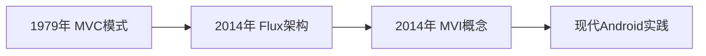

# MVI架构模式

## 一、MVI架构的本质解析

1. **核心定位**：解决Android开发中状态管理的可预测性问题
2. **核心特征**：
   - 单向数据流（Unidirectional Data Flow）
   - 不可变状态（Immutable State）
   - 意图驱动（Intent-Driven）
3. **设计目标**：
   - 消除UI与业务逻辑的耦合
   - 保障状态变化的可追溯性
   - 提升复杂界面的可维护性

## 二、架构演进与思想溯源

### 1. 历史里程碑



- **Flux架构贡献**：
  - 确立Action → Dispatcher → Store → View的单向数据流
  - 引入共享状态不可变原则
- **André Staltz的突破**（2014）：
  - 用响应式流替代Dispatcher
  - 将用户交互抽象为Intent事件流
  - 建立 Model ← Intent → View 的响应环

### 2. 核心概念澄清（关键认知修正）


| **误区**        | **正解**                            |
| --------------- | ----------------------------------- |
| MVI=Redux       | MVI早于Redux且采用分布式状态管理    |
| 必须全局Store   | 可模块化独立实现（ViewModel作用域） |
| MVI只是MVVM变种 | 本质区别：单向流 VS 双向绑定        |

## 三、Android现代实现方案

### 1. 核心组件实现

```kotlin
// 1. 定义不可变状态
data class LoginState(
    val username: String = "",
    val isLoading: Boolean = false,
    val error: String? = null
)

// 2. 意图密封类
sealed interface LoginIntent {
    data class UpdateUsername(val text: String) : LoginIntent
    object SubmitLogin : LoginIntent
    object ResetForm : LoginIntent
}

// 3. ViewModel实现
class LoginViewModel : ViewModel() {
    private val _state = MutableStateFlow(LoginState())
    val state: StateFlow<LoginState> = _state.asStateFlow()

    fun processIntent(intent: LoginIntent) {
        when (intent) {
            is LoginIntent.UpdateUsername -> 
                _state.update { it.copy(username = intent.text) }
          
            LoginIntent.SubmitLogin -> {
                _state.update { it.copy(isLoading = true) }
                viewModelScope.launch {
                    // 网络请求等副作用操作
                    _state.update { /* 更新状态 */ }
                }
            }
        }
    }
}
```

### 2. Jetpack组件整合策略

1. **UI层实现要点**：
   ```kotlin
   @Composable
   fun LoginScreen(viewModel: LoginViewModel) {
       val state by viewModel.state.collectAsStateWithLifecycle()

       Column {
           TextField(
               value = state.username,
               onValueChange = { 
                   viewModel.processIntent(LoginIntent.UpdateUsername(it)) 
               }
           )
           // 状态驱动UI变化
           if (state.isLoading) CircularProgressIndicator()
       }
   }
   ```
2. **副作用处理机制**：
   - 通过独立`SharedFlow`传递一次性事件（如Toast、导航）
   - 保持reducer函数纯净

## 四、技术选型决策指南

### 适用性评估矩阵


| **项目特征**        | 推荐架构    | 原因分析              |
| ------------------- | ----------- | --------------------- |
| 大型团队协作项目    | ✅ MVI      | 强制规范降低沟通成本  |
| 复杂表单/多状态界面 | ✅ MVI      | 状态管理可预测性优势  |
| 简单CRUD应用        | 🟡 MVVM     | 避免MVI的样板代码负担 |
| 原型验证阶段        | ⚠️ 无架构 | 快速迭代优先          |

### 实施收益分析

- ✅ **崩溃率降低**：不可变状态消除并发修改风险
- ✅ **调试效率提升**：状态变更路径可完整追溯
- ⚠️ **学习成本**：需掌握响应式编程及状态机思维
- ⚠️ **初期开发量**：相比MVVM增加约20%代码量

## 五、实践总结与反思

1. **模式本质认知**：

   - MVI是约束框架而非具体实现
   - 核心价值在于建立可靠的「事件→状态→UI」映射关系
2. **Android适配要点**：

   - 善用`StateFlow`+`ViewModel`实现轻量化状态容器
   - Compose的声明式UI与MVI形成绝佳组合
3. **实施建议**：

   - 从关键业务模块开始渐进式改造
   - 建立团队状态设计规范（如状态树深度限制）
   - 结合单元测试验证状态转换逻辑

---

**参考文档**：
[聊聊 MVI 的发展史和现代 Android 实践](https://mp.weixin.qq.com/s?__biz=Mzg5MzYxNTI5Mg==&mid=2247499098&idx=1&sn=3fcc663fcab5247b5c51e1ea7d9d32b3&scene=21&poc_token=HGf4YWijiArShHHI7Xv1neXWocMIAAl_6iVJHYP9)

**学习日期**：2025年6月30日
