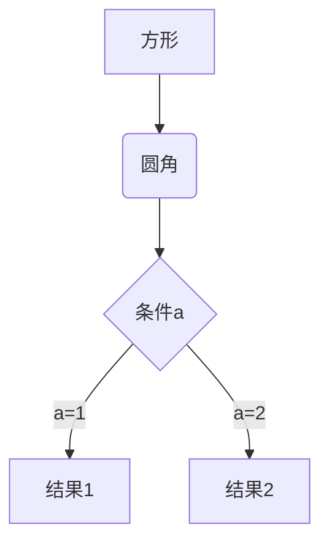
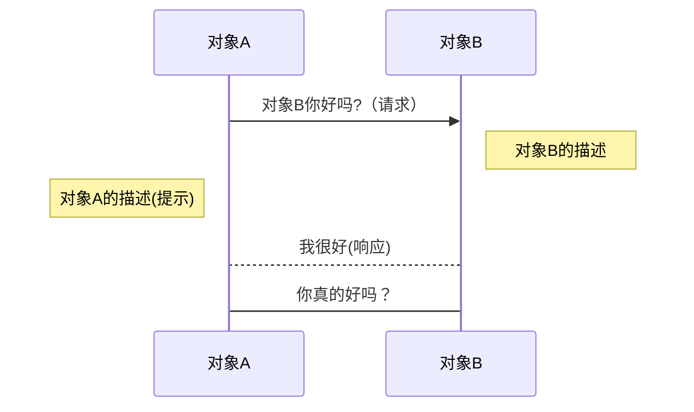
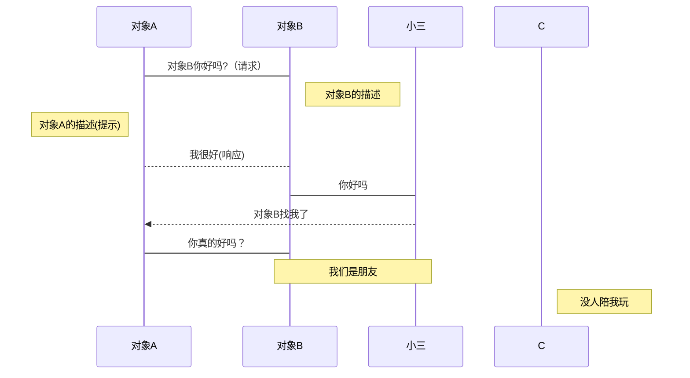
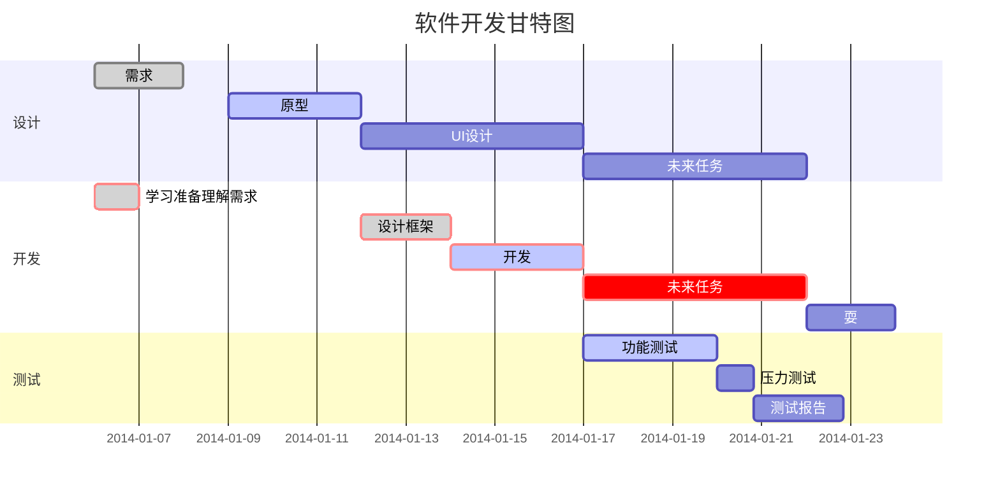
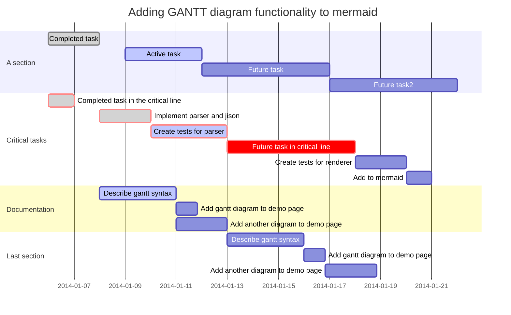
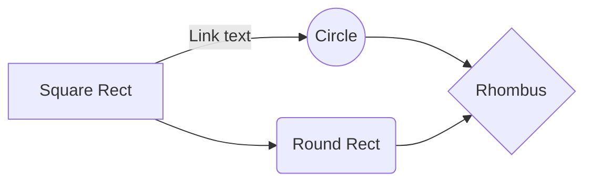
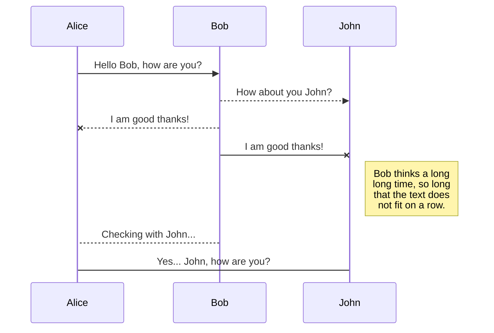
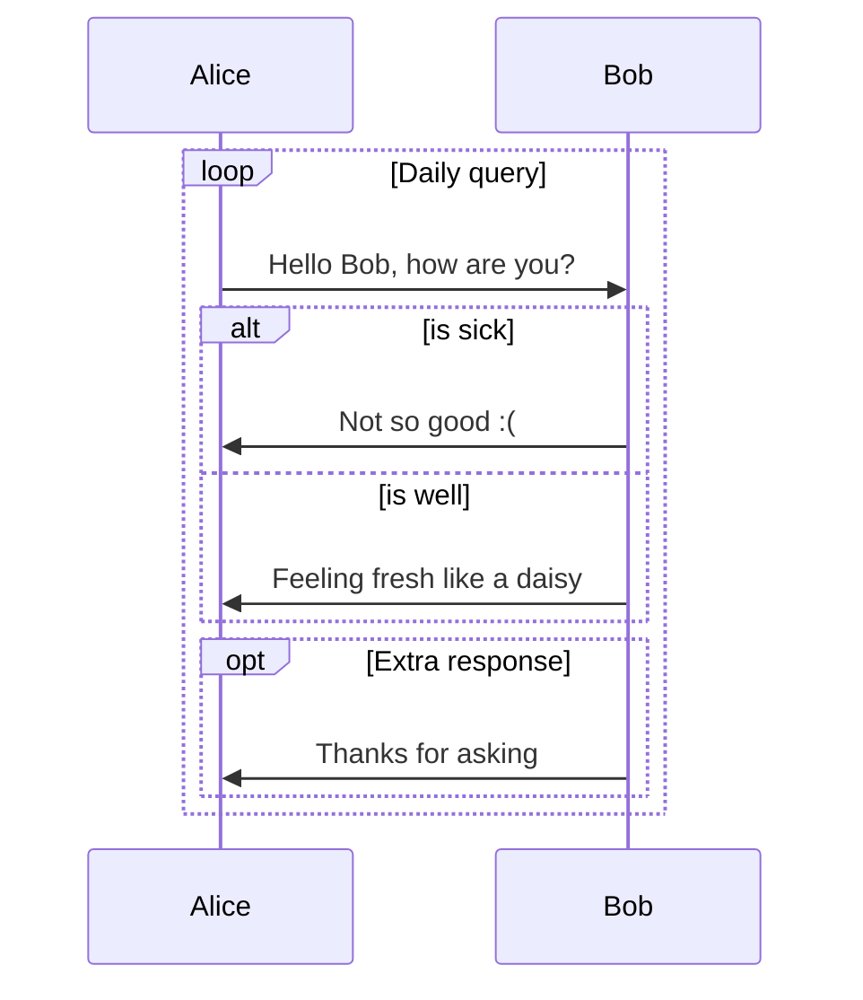

# Mermaid（流程图绘制）

### 一、流程图

#### 1.横向流程图

```mermaid
%% LR表示从左到右布局，TB表示从上到下布局
graph LR
A([椭圆形]) -->B(圆角)
    B --> C{菱形}
    C ---|线条无箭头| D[方形]
    C ===|粗线条无箭头| E[(圆柱形)]
    C ==>|粗线条箭头| F((圆形))
    C -->|粗线条箭头| G[[柱形]]
    C -.虚线条箭头.->H>箭头形状]
    C -.徐线条无箭头.-I[I]
```

#### 2. 竖向流程图

```mermaid
graph TD
A[方形] --> B(圆角)
    B --> C{条件a}
    C --> |a=1| D[结果1]
    C --> |a=2| E[结果2]
```

### 二、时序图

```mermaid
sequenceDiagram
对象A->>对象B: 对象B你好吗?（请求）
Note right of 对象B: 对象B的描述
Note left of 对象A: 对象A的描述(提示)
对象B-->对象A: 我很好(响应)
对象A->对象B: 你真的好吗？
```

```mermaid
sequenceDiagram
对象A->对象B: 对象B你好吗?（请求）
Note right of 对象B: 对象B的描述
Note left of 对象A: 对象A的描述(提示)
对象B-->对象A: 我很好(响应)
对象B->小三: 你好吗
小三-->>对象A: 对象B找我了
对象A->对象B: 你真的好吗？
Note over 小三,对象B: 我们是朋友
participant C
Note right of C: 没人陪我玩
```

### 三、甘特图

```mermaid
gantt
dateFormat  YYYY-MM-DD
title 软件开发甘特图
section 设计
    需求                    :done,    des1, 2014-01-06,2014-01-08
    原型                    :active,  des2, 2014-01-09, 3d
    UI设计                  :         des3, after des2, 5d
    未来任务                :         des4, after des3, 5d
section 开发
    学习准备理解需求        :crit, done, 2014-01-06,24h
    设计框架                :crit, done, after des2, 2d
    开发                    :crit, active, 3d
    未来任务                :crit, 5d
    耍                      :2d
section 测试
    功能测试                :active, a1, after des3, 3d
    压力测试                :after a1  , 20h
    测试报告                : 48h
```

```mermaid
    gantt
    dateFormat  YYYY-MM-DD
    title Adding GANTT diagram functionality to mermaid
 
    section A section
    Completed task            :done,    des1, 2014-01-06,2014-01-08
    Active task               :active,  des2, 2014-01-09, 3d
    Future task               :         des3, after des2, 5d
    Future task2              :         des4, after des3, 5d
 
    section Critical tasks
    Completed task in the critical line :crit, done, 2014-01-06,24h
    Implement parser and jison          :crit, done, after des1, 2d
    Create tests for parser             :crit, active, 3d
    Future task in critical line        :crit, 5d
    Create tests for renderer           :2d
    Add to mermaid                      :1d
 
    section Documentation
    Describe gantt syntax               :active, a1, after des1, 3d
    Add gantt diagram to demo page      :after a1  , 20h
    Add another diagram to demo page    :doc1, after a1  , 48h
 
    section Last section
    Describe gantt syntax               :after doc1, 3d
    Add gantt diagram to demo page      :20h
    Add another diagram to demo page    :48h
```

三、其他测试

```mermaid
graph LR
A[Square Rect] -- Link text --> B((Circle))
A --> C(Round Rect)
B --> D{Rhombus}
C --> D
```

```mermaid
graph TB
sq[Square shape] --> ci((Circle shape))
 
subgraph A subgraph
    od>Odd shape]-- Two line<br>edge comment --> ro
    di{Diamond with <br/> line break} -.-> ro(Rounded<br>square<br>shape)
    di==>ro2(Rounded square shape)
end
 
%% Notice that no text in shape are added here instead that is appended further down
e --> od3>Really long text with linebreak<br>in an Odd shape]
 
%% Comments after double percent signs
e((Inner / circle<br>and some odd <br>special characters)) --> f(,.?!+-*ز)
 
cyr[Cyrillic]-->cyr2((Circle shape Начало));
 
 classDef green fill:#9f6,stroke:#333,stroke-width:2px;
 classDef orange fill:#f96,stroke:#333,stroke-width:4px;
 class sq,e green
 class di orange
```

```mermaid
sequenceDiagram
Alice ->> Bob: Hello Bob, how are you?
Bob-->>John: How about you John?
Bob--x Alice: I am good thanks!
Bob-x John: I am good thanks!
Note right of John: Bob thinks a long<br/>long time, so long<br/>that the text does<br/>not fit on a row.
 
Bob-->Alice: Checking with John...
Alice->John: Yes... John, how are you?
```

```mermaid
sequenceDiagram
loop Daily query
    Alice->>Bob: Hello Bob, how are you?
    alt is sick
        Bob->>Alice: Not so good :(
    else is well
        Bob->>Alice: Feeling fresh like a daisy
    end
 
    opt Extra response
        Bob->>Alice: Thanks for asking
    end
end
```

参考：

1. [Mermaid](https://mermaid-js.github.io/mermaid/)

--8<--
uml.txt

mathjax.txt
--8<--
