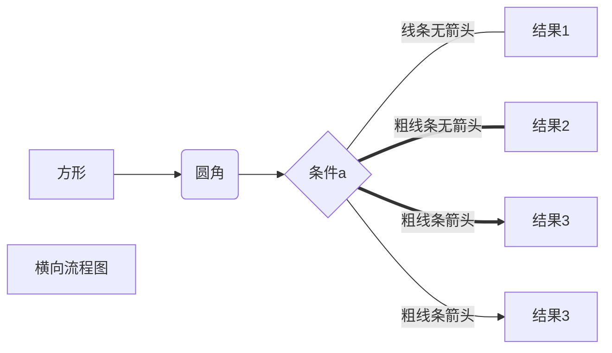
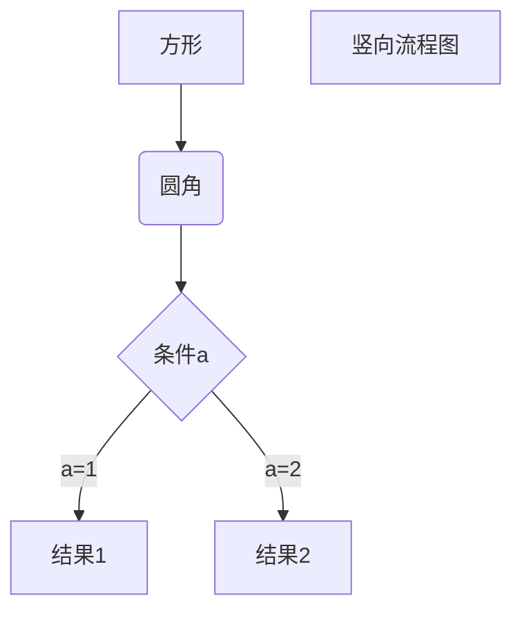
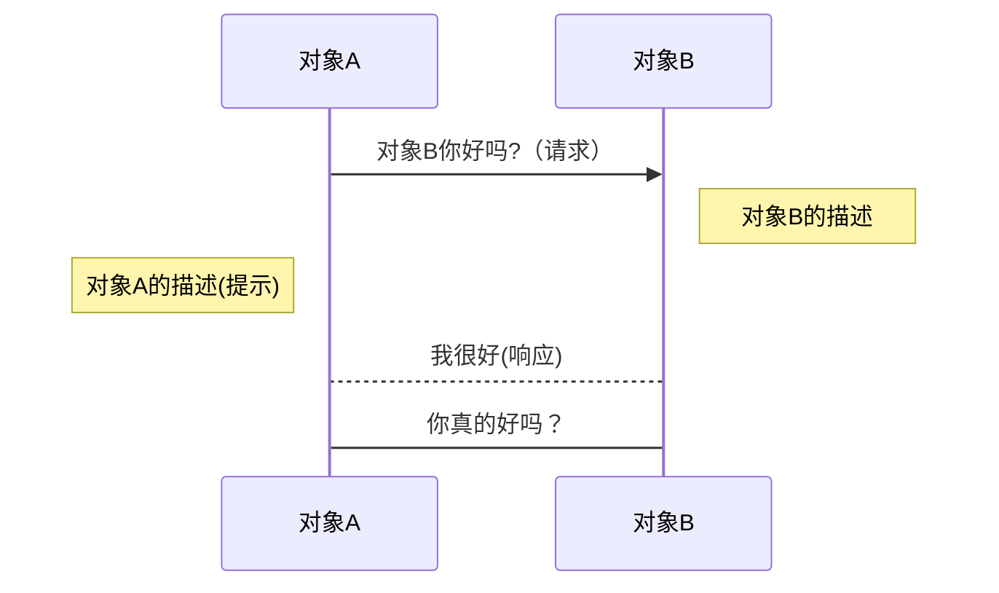
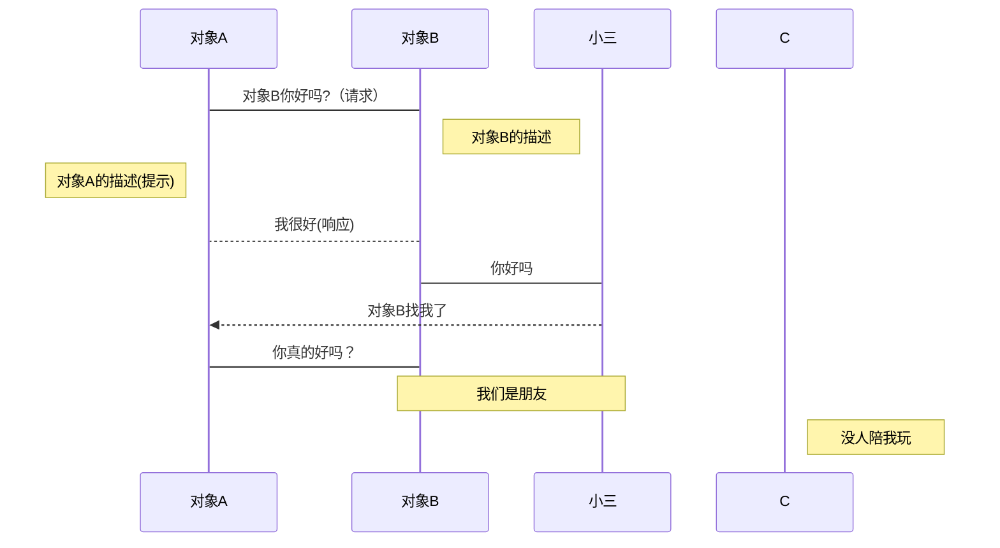
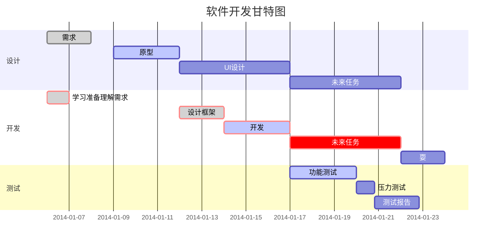

# Mermaid（流程图绘制）

### 一、流程图

```mermaid
graph LR
A[方形] -->B(圆角)
    B --> C{条件a}
    C ---|线条无箭头| D[结果1]
    C ===|粗线条无箭头| E[结果2]
    C ==>|粗线条箭头| F[结果3]
    C -->|粗线条箭头| G[结果3]
    
    Title[横向流程图]
```

```mermaid
graph TD
A[方形] --> B(圆角)
    B --> C{条件a}
    C --> |a=1| D[结果1]
    C --> |a=2| E[结果2]
    F[竖向流程图]
```

### 二、时序图

```mermaid
sequenceDiagram
对象A->>对象B: 对象B你好吗?（请求）
Note right of 对象B: 对象B的描述
Note left of 对象A: 对象A的描述(提示)
对象B-->对象A: 我很好(响应)
对象A->对象B: 你真的好吗？
```

```mermaid
sequenceDiagram
对象A->对象B: 对象B你好吗?（请求）
Note right of 对象B: 对象B的描述
Note left of 对象A: 对象A的描述(提示)
对象B-->对象A: 我很好(响应)
对象B->小三: 你好吗
小三-->>对象A: 对象B找我了
对象A->对象B: 你真的好吗？
Note over 小三,对象B: 我们是朋友
participant C
Note right of C: 没人陪我玩
```

### 三、甘特图

```mermaid
gantt
dateFormat  YYYY-MM-DD
title 软件开发甘特图
section 设计
    需求                    :done,    des1, 2014-01-06,2014-01-08
    原型                    :active,  des2, 2014-01-09, 3d
    UI设计                  :         des3, after des2, 5d
    未来任务                :         des4, after des3, 5d
section 开发
    学习准备理解需求        :crit, done, 2014-01-06,24h
    设计框架                :crit, done, after des2, 2d
    开发                    :crit, active, 3d
    未来任务                :crit, 5d
    耍                      :2d
section 测试
    功能测试                :active, a1, after des3, 3d
    压力测试                :after a1  , 20h
    测试报告                : 48h
```

参考：

1. [Mermaid](https://mermaid-js.github.io/mermaid/)

