# Mermaid（流程图绘制）

### 一、流程图

#### 1.横向流程图

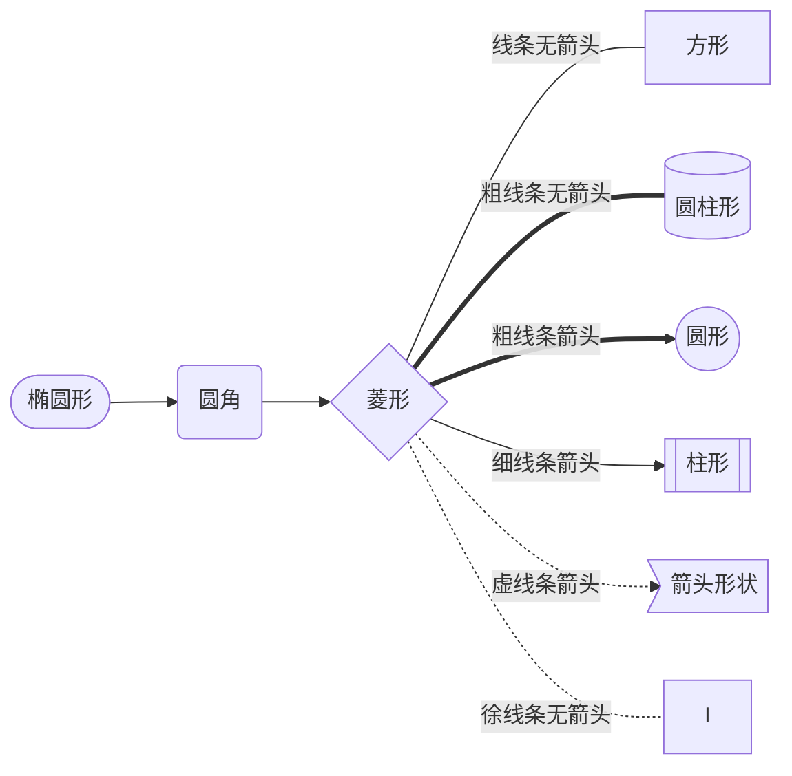
```mermaid
%% LR表示从左到右布局，TB表示从上到下布局
graph LR
A([椭圆形]) -->B(圆角)
    B --> C{菱形}
    C ---|线条无箭头| D[方形]
    C ===|粗线条无箭头| E[(圆柱形)]
    C ==>|粗线条箭头| F((圆形))
    C -->|细线条箭头| G[[柱形]]
    C -.虚线条箭头.->H>箭头形状]
    C -.徐线条无箭头.-I[I]
```

#### 2. 竖向流程图

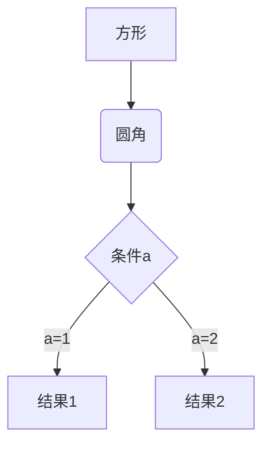
```mermaid
graph TD
A[方形] --> B(圆角)
    B --> C{条件a}
    C --> |a=1| D[结果1]
    C --> |a=2| E[结果2]
```

#### 3.  嵌套流程图

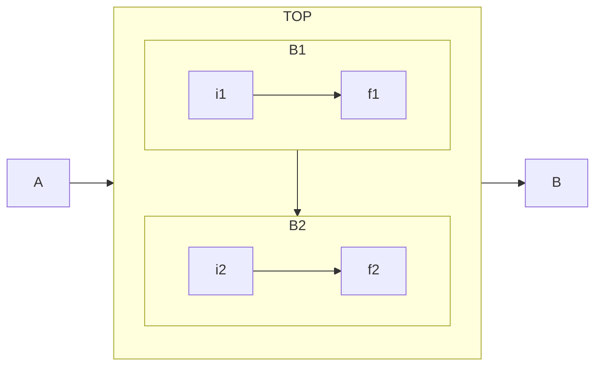
```mermaid
flowchart LR
  subgraph TOP
    subgraph B1
        i1 -->f1
    end
    subgraph B2
        i2 -->f2
    end
  end
  A --> TOP --> B
  B1 --> B2
```

### 二、时序图

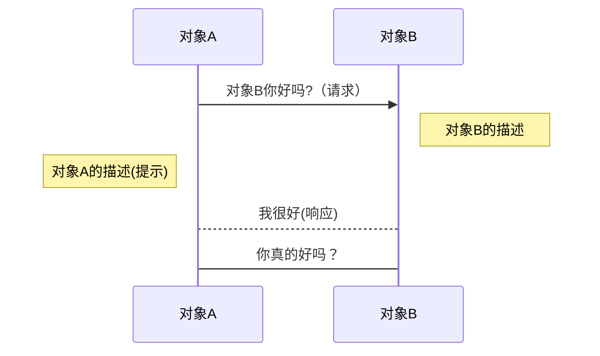
```mermaid
sequenceDiagram
对象A->>对象B: 对象B你好吗?（请求）
Note right of 对象B: 对象B的描述
Note left of 对象A: 对象A的描述(提示)
对象B-->对象A: 我很好(响应)
对象A->对象B: 你真的好吗？
```

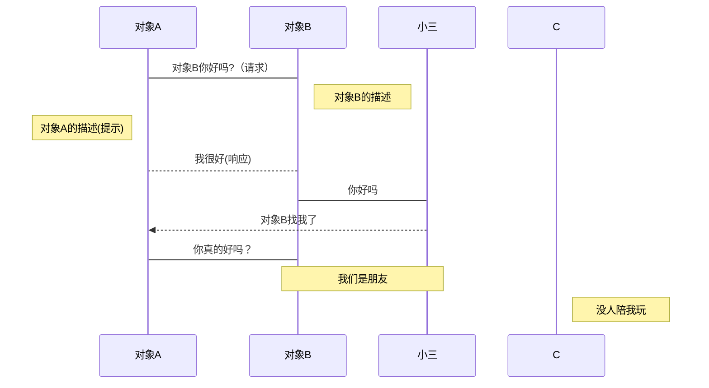
```mermaid
sequenceDiagram
对象A->对象B: 对象B你好吗?（请求）
Note right of 对象B: 对象B的描述
Note left of 对象A: 对象A的描述(提示)
对象B-->对象A: 我很好(响应)
对象B->小三: 你好吗
小三-->>对象A: 对象B找我了
对象A->对象B: 你真的好吗？
Note over 小三,对象B: 我们是朋友
participant C
Note right of C: 没人陪我玩
```

### 三、甘特图

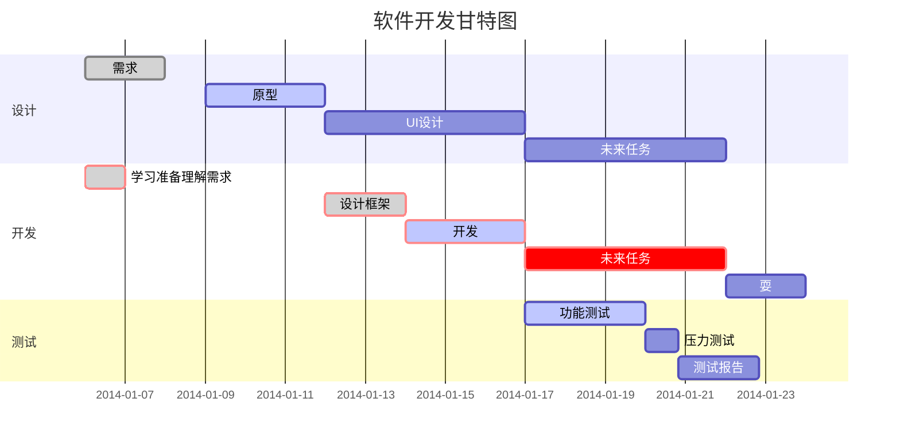
```mermaid
gantt
dateFormat  YYYY-MM-DD
title 软件开发甘特图
section 设计
    需求                    :done,    des1, 2014-01-06,2014-01-08
    原型                    :active,  des2, 2014-01-09, 3d
    UI设计                  :         des3, after des2, 5d
    未来任务                :         des4, after des3, 5d
section 开发
    学习准备理解需求        :crit, done, 2014-01-06,24h
    设计框架                :crit, done, after des2, 2d
    开发                    :crit, active, 3d
    未来任务                :crit, 5d
    耍                      :2d
section 测试
    功能测试                :active, a1, after des3, 3d
    压力测试                :after a1  , 20h
    测试报告                : 48h
```

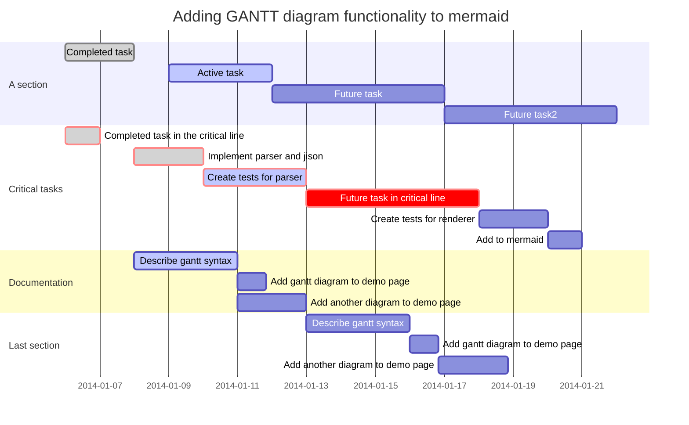
```mermaid
gantt
    dateFormat  YYYY-MM-DD
    title Adding GANTT diagram functionality to mermaid
 
    section A section
    Completed task            :done,    des1, 2014-01-06,2014-01-08
    Active task               :active,  des2, 2014-01-09, 3d
    Future task               :         des3, after des2, 5d
    Future task2              :         des4, after des3, 5d
 
    section Critical tasks
    Completed task in the critical line :crit, done, 2014-01-06,24h
    Implement parser and jison          :crit, done, after des1, 2d
    Create tests for parser             :crit, active, 3d
    Future task in critical line        :crit, 5d
    Create tests for renderer           :2d
    Add to mermaid                      :1d
 
    section Documentation
    Describe gantt syntax               :active, a1, after des1, 3d
    Add gantt diagram to demo page      :after a1  , 20h
    Add another diagram to demo page    :doc1, after a1  , 48h
 
    section Last section
    Describe gantt syntax               :after doc1, 3d
    Add gantt diagram to demo page      :20h
    Add another diagram to demo page    :48h
```

### 四、类图

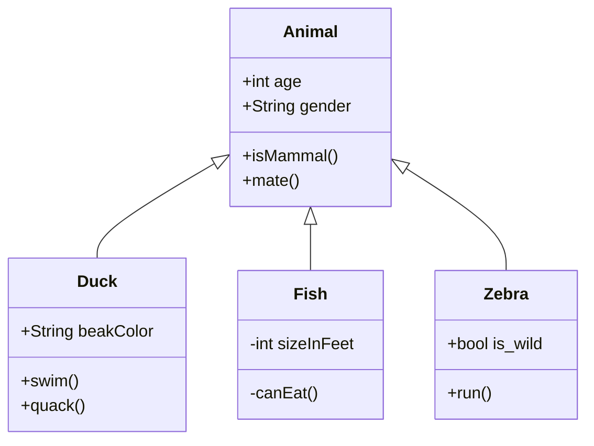
```mermaid
classDiagram
      Animal <|-- Duck
      Animal <|-- Fish
      Animal <|-- Zebra
      Animal : +int age
      Animal : +String gender
      Animal: +isMammal()
      Animal: +mate()
      class Duck{
          +String beakColor
          +swim()
          +quack()
      }
      class Fish{
          -int sizeInFeet
          -canEat()
      }
      class Zebra{
          +bool is_wild
          +run()
      }
```

### 五、状态图

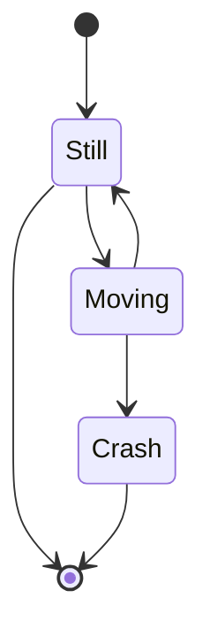
```mermaid
stateDiagram-v2
    [*] --> Still
    Still --> [*]

    Still --> Moving
    Moving --> Still
    Moving --> Crash
    Crash --> [*]
```

### 六、实体关系图

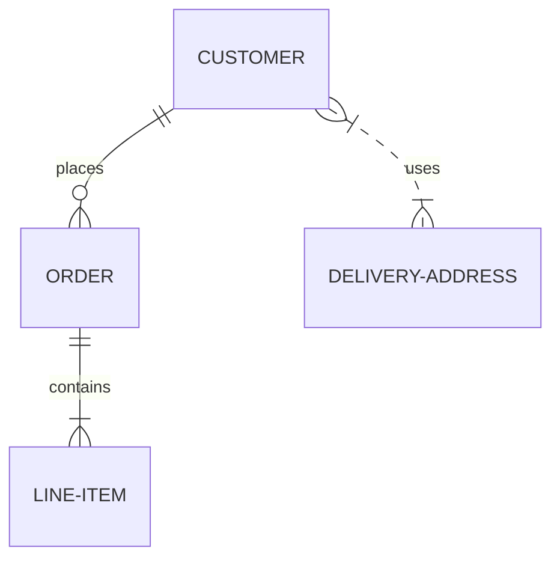
```mermaid
erDiagram
    CUSTOMER ||--o{ ORDER : places
    ORDER ||--|{ LINE-ITEM : contains
    CUSTOMER }|..|{ DELIVERY-ADDRESS : uses
```

### 七、用户旅程图

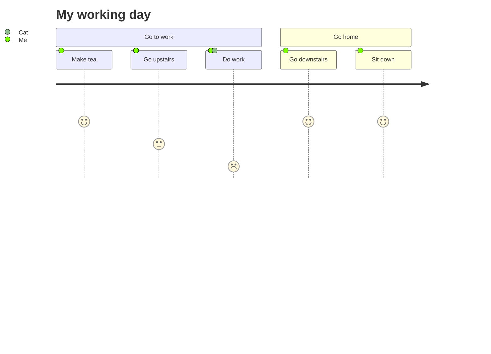
```mermaid
journey
    title My working day
    section Go to work
      Make tea: 5: Me
      Go upstairs: 3: Me
      Do work: 1: Me, Cat
    section Go home
      Go downstairs: 5: Me
      Sit down: 5: Me
```

### 八、饼图

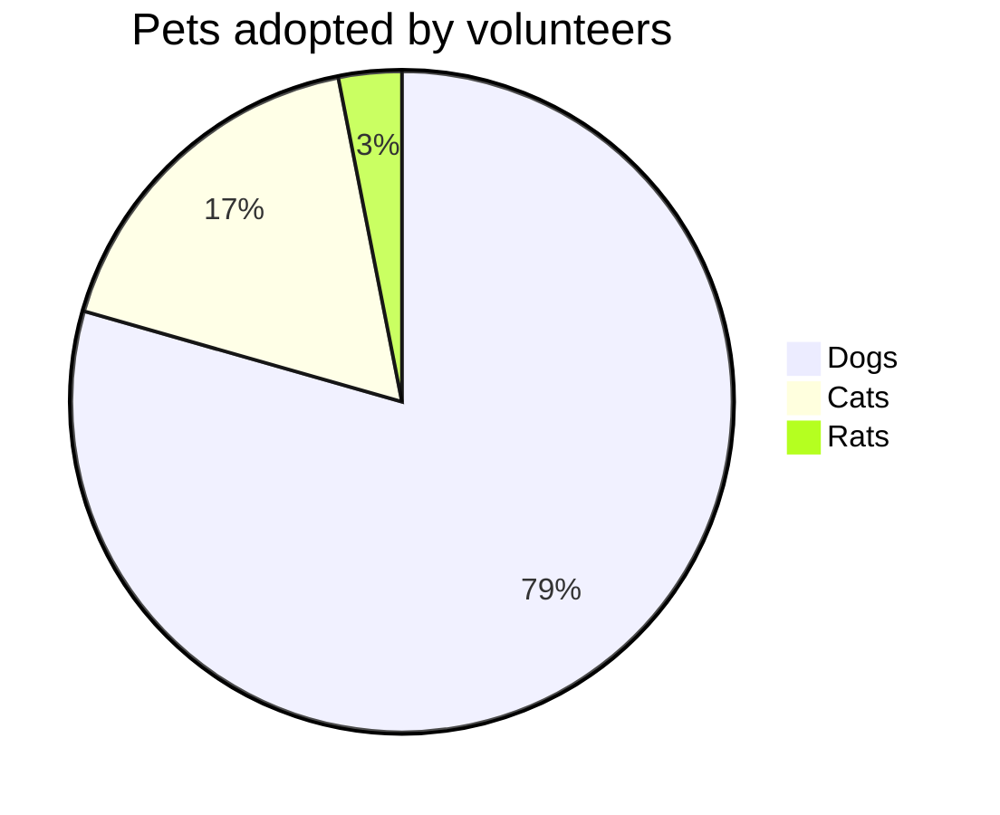
```mermaid
pie 
title Pets adopted by volunteers
    "Dogs" : 386
    "Cats" : 85
    "Rats" : 15
```

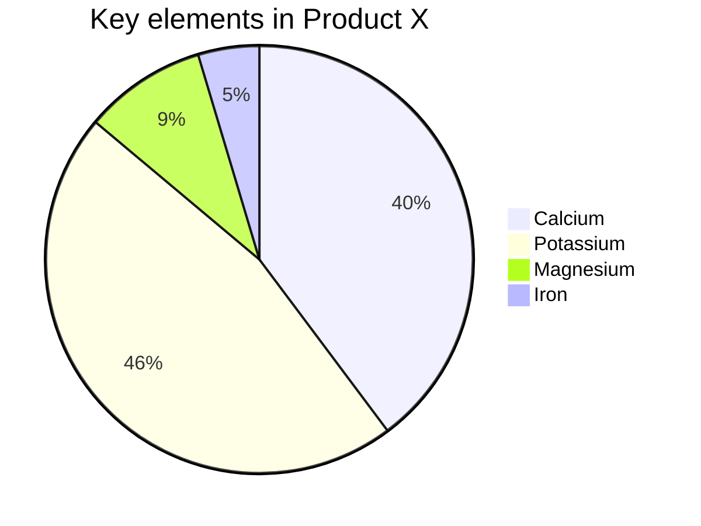
```mermaid
pie
    title Key elements in Product X
    "Calcium" : 42.96
    "Potassium" : 50.05
    "Magnesium" : 10.01
    "Iron" :  5
```

### 九、其他测试

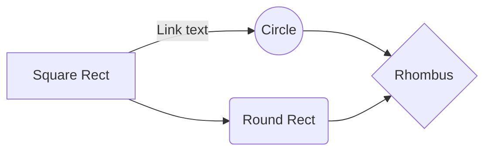
```mermaid
graph LR
A[Square Rect] -- Link text --> B((Circle))
A --> C(Round Rect)
B --> D{Rhombus}
C --> D
```

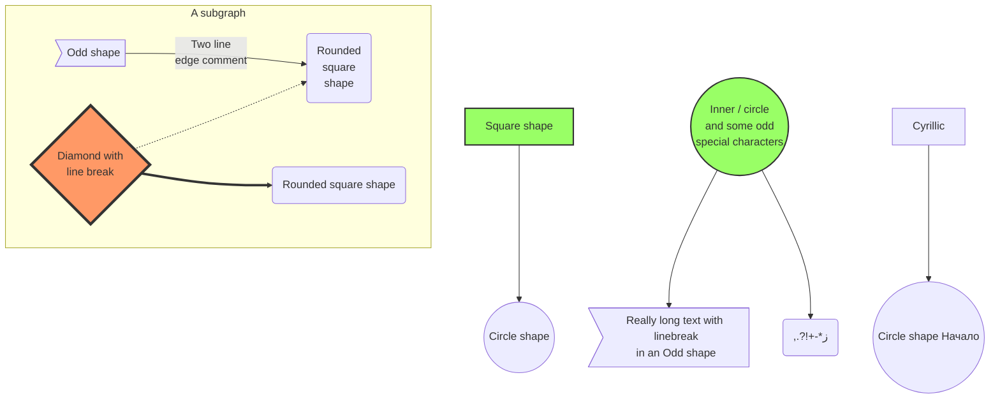
```mermaid
graph TB
sq[Square shape] --> ci((Circle shape))
 
subgraph A subgraph
    od>Odd shape]-- Two line<br>edge comment --> ro
    di{Diamond with <br/> line break} -.-> ro(Rounded<br>square<br>shape)
    di==>ro2(Rounded square shape)
end
 
%% Notice that no text in shape are added here instead that is appended further down
e --> od3>Really long text with linebreak<br>in an Odd shape]
 
%% Comments after double percent signs
e((Inner / circle<br>and some odd <br>special characters)) --> f(,.?!+-*ز)
 
cyr[Cyrillic]-->cyr2((Circle shape Начало));
 
 classDef green fill:#9f6,stroke:#333,stroke-width:2px;
 classDef orange fill:#f96,stroke:#333,stroke-width:4px;
 class sq,e green
 class di orange
```

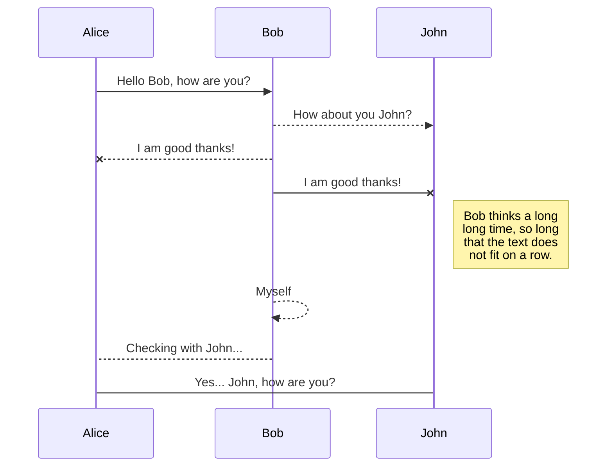
```mermaid
sequenceDiagram
Alice ->> Bob: Hello Bob, how are you?
Bob-->>John: How about you John?
Bob--x Alice: I am good thanks!
Bob-x John: I am good thanks!
Note right of John: Bob thinks a long<br/>long time, so long<br/>that the text does<br/>not fit on a row.
Bob-->>Bob:Myself
Bob-->Alice: Checking with John...
Alice->John: Yes... John, how are you?
```

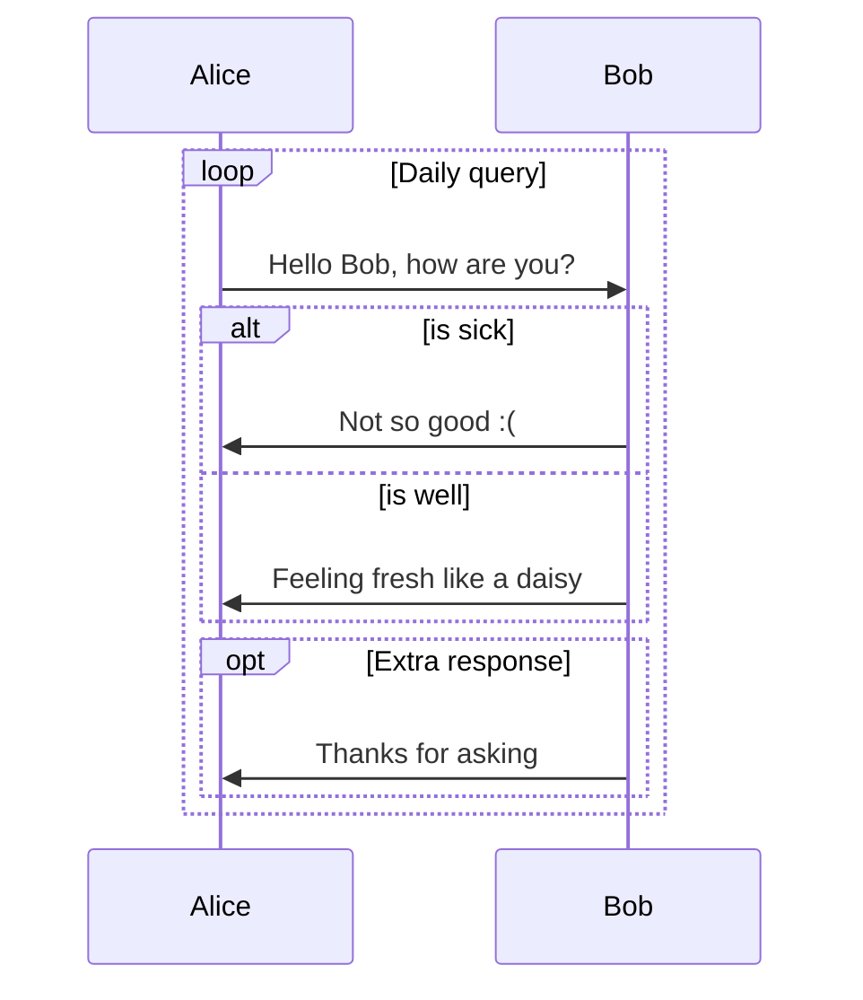
```mermaid
sequenceDiagram
loop Daily query
    Alice->>Bob: Hello Bob, how are you?
    alt is sick
        Bob->>Alice: Not so good :(
    else is well
        Bob->>Alice: Feeling fresh like a daisy
    end
 
    opt Extra response
        Bob->>Alice: Thanks for asking
    end
end
```

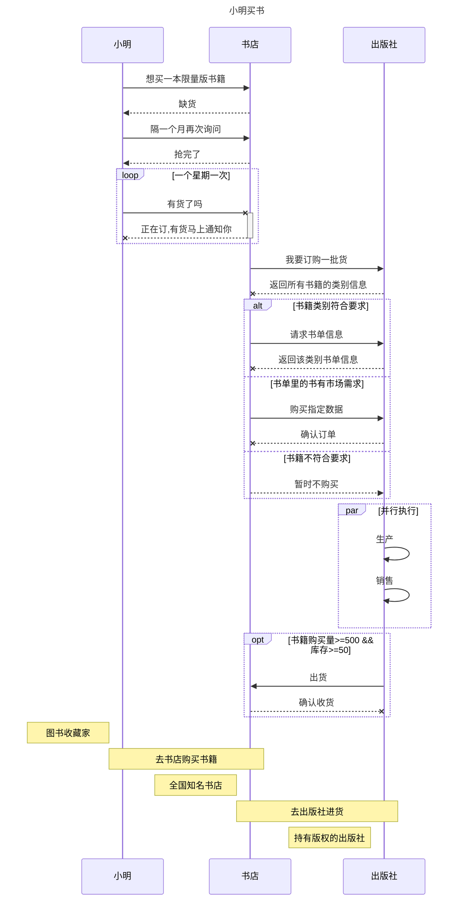
```mermaid
sequenceDiagram
Title: 小明买书

participant consumer as 小明
participant store as 书店
participant publisher as 出版社

consumer ->> store: 想买一本限量版书籍
store -->> consumer: 缺货
consumer ->> store: 隔一个月再次询问
store -->> consumer: 抢完了
loop 一个星期一次
consumer -x +store: 有货了吗
store --x -consumer: 正在订,有货马上通知你
end

store ->> publisher: 我要订购一批货
publisher --x store: 返回所有书籍的类别信息

alt 书籍类别符合要求
store ->> publisher: 请求书单信息
publisher --x store: 返回该类别书单信息
else 书单里的书有市场需求
store ->> publisher: 购买指定数据
publisher --x store: 确认订单
else 书籍不符合要求
store -->> publisher: 暂时不购买
end

par 并行执行
publisher ->> publisher : 生产
publisher ->> publisher : 销售
end

opt 书籍购买量>=500 && 库存>=50
publisher ->> store : 出货
store --x publisher : 确认收货
end

Note left of consumer : 图书收藏家
Note over consumer,store : 去书店购买书籍
Note left of store : 全国知名书店
Note over store,publisher : 去出版社进货
Note left of publisher : 持有版权的出版社
```

参考：

1. [Mermaid](https://mermaid-js.github.io/mermaid/)
1. [MarkDown画图(实例讲解) —— 流程图、序列图、饼图、甘特图](https://www.jianshu.com/p/77cc07f47cdc)

--8<--
uml.txt

mathjax.txt
--8<--
